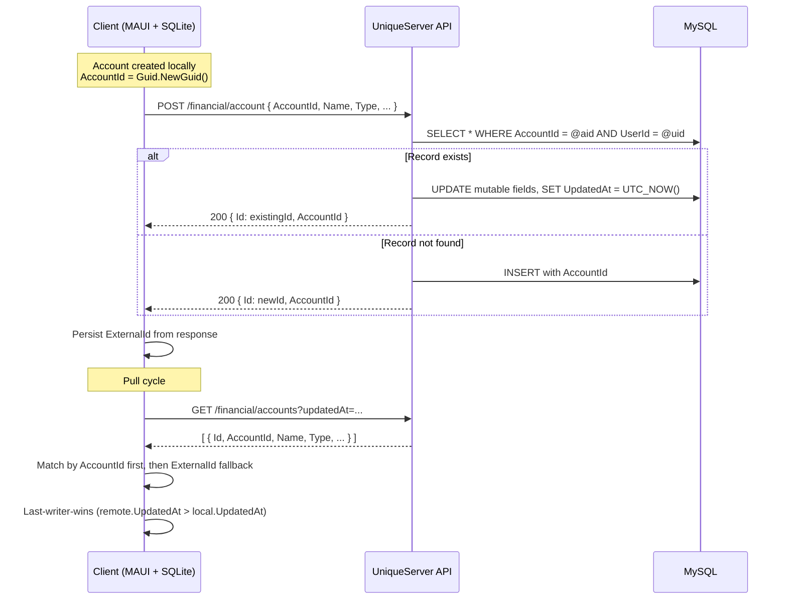
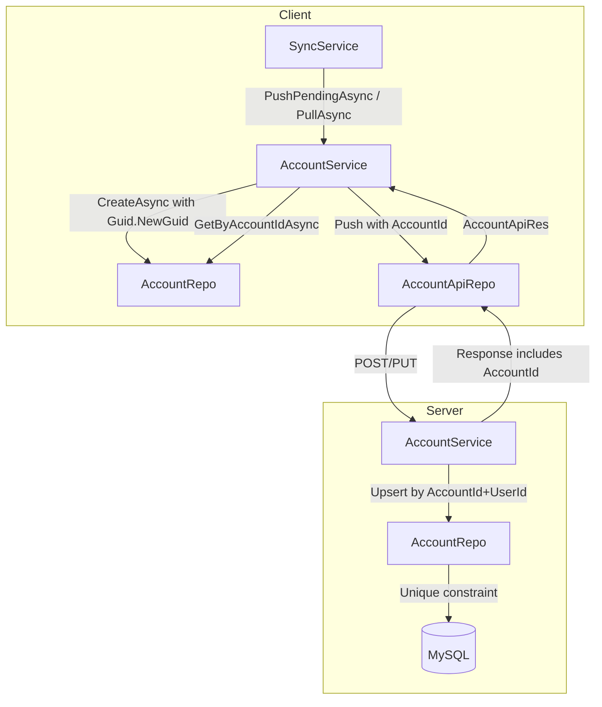
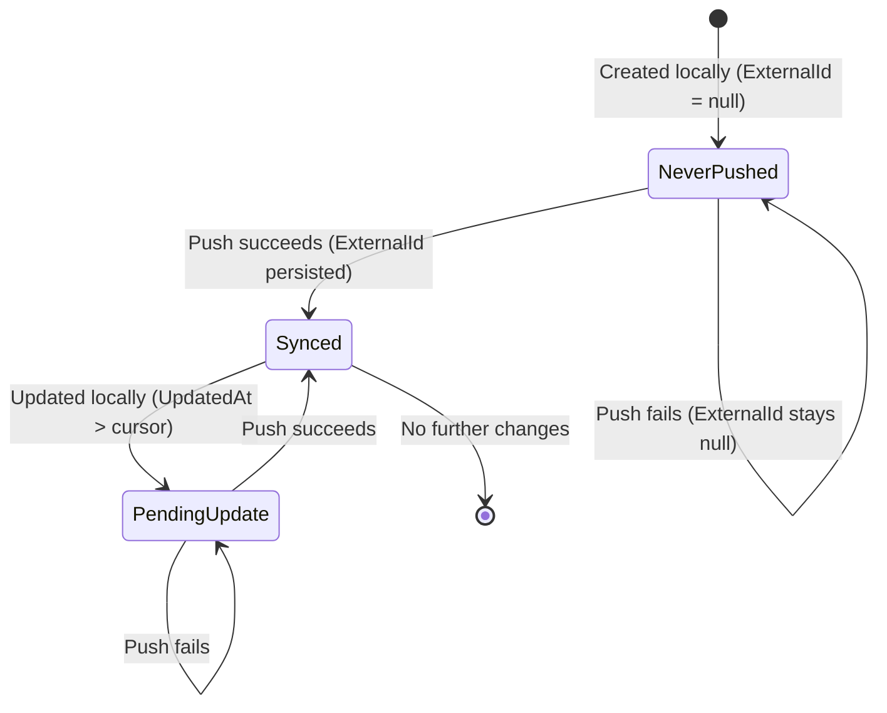
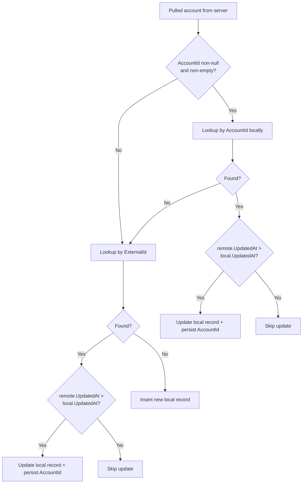

# Design Document: Account Guid Sync

## Overview

This design introduces a stable `AccountId` (Guid) field across the XpemFinancial client and UniqueServer backend, replacing the reliance on `ExternalId` (server auto-increment PK) as the sync matching key. The Guid is assigned at account creation time on the client and becomes the canonical cross-device identifier.

Unlike the transaction-guid-sync feature (which also introduced a deterministic Guid derivation for recurring occurrences), accounts are simpler: each account gets a random `Guid.NewGuid()` at creation time. The core complexity lies in replacing the current POST/PUT split with a single upsert-by-Guid approach on the server and introducing AccountId-first matching during pull on the client.

### Design Goals

1. **Deterministic cross-device matching** — Replace ExternalId-based matching with AccountId (Guid) as the primary sync key.
2. **Server-side upsert** — A single endpoint handles both create and update via AccountId lookup, eliminating the POST/PUT split for accounts with a valid Guid.
3. **Incremental rollout** — `AccountId` coexists with `ExternalId`; records with `Guid.Empty` fall back to the current behavior.
4. **No data loss** — Server migration backfills existing records; client migration defaults to `Guid.Empty`.
5. **Consistency with transaction-guid-sync** — Follow the same architectural patterns established for transactions.

## Architecture



### High-Level Component Interaction



## Components and Interfaces

### Client-Side Changes

#### AccountDTO (Model)

Add an `AccountId` property of type `Guid`:

```csharp
[Table("Account")]
public class AccountDTO : BaseDTO
{
    /// <summary>
    /// Stable cross-device identifier assigned at creation time.
    /// Used as the primary key for sync matching.
    /// Default: Guid.Empty for legacy records (backward-compatible).
    /// </summary>
    public Guid AccountId { get; set; }

    // ... existing properties unchanged
}
```

SQLite schema: non-nullable column, default `Guid.Empty` for existing rows.

#### AccountRepo (Client)

New interface method:

```csharp
Task<AccountDTO?> GetByAccountIdAsync(Guid accountId);
```

Implementation guards against `Guid.Empty` (returns null immediately without querying).

#### AccountService (Client)

Modifications to:
- **CreateAsync**: Assign `Guid.NewGuid()` when `AccountId == Guid.Empty` before persisting.
- **EnsureDefaultAccountAsync**: Same Guid assignment logic.
- **Push**: Include `AccountId` in the `AccountReq` payload. The existing POST/PUT decision continues for backward compatibility when `AccountId == Guid.Empty`.
- **PullAsync**: Match by `AccountId` first (via `GetByAccountIdAsync`), then fall back to `ExternalId`. Apply last-writer-wins (`remote.UpdatedAt > local.UpdatedAt`). When a record matched by `ExternalId` receives a non-empty `AccountId` from the response, persist it locally.
- **UpdateAsync**: Must NOT overwrite an existing non-empty `AccountId`.

#### AccountReq (Client Model)

Add:
```csharp
public Guid? AccountId { get; set; }
```

#### AccountApiRes (Client Model)

Add:
```csharp
public Guid? AccountId { get; set; }
```

#### AccountApiRepo (Client)

No interface changes. The existing `PostAccountAsync` and `PutAccountAsync` already serialize `AccountReq`, which will now include `AccountId`. The `AccountApiRes` model gains an `AccountId` field.

### Server-Side Changes

#### AccountDTO (Server Model)

Add:
```csharp
/// <summary>
/// Stable cross-device identifier. Nullable during transition period.
/// Unique constraint scoped to UserId.
/// </summary>
public Guid? AccountId { get; set; }
```

MySQL schema: nullable `CHAR(36)` column with a composite unique index on `(AccountId, UserId)` where `AccountId IS NOT NULL`.

#### AccountReq (Server Model)

Add:
```csharp
public Guid? AccountId { get; set; }
```

#### AccountRes (Server Model)

Add:
```csharp
public Guid? AccountId { get; set; }
```

The field is nullable in responses because legacy records pulled before migration may still lack an AccountId (although the migration backfills all existing records).

#### AccountRepo (Server)

New interface method:

```csharp
Task<AccountDTO?> FindByAccountIdAsync(Guid accountId, int userId);
```

Implementation uses the composite index `(AccountId, UserId)` and guards against `Guid.Empty`.

#### AccountService (Server)

Modify `CreateAsync` to implement upsert logic:

```
if (req.AccountId != null && req.AccountId != Guid.Empty)
    existing = await repo.FindByAccountIdAsync(req.AccountId.Value, uid)
    if (existing != null) → UPDATE existing mutable fields, return existing.Id + AccountId
    else → INSERT with req.AccountId, return new.Id + AccountId
else
    → INSERT with server-generated Guid.NewGuid(), return new.Id + AccountId
```

The existing `UpdateAsync(int id, AccountReq req, int uid)` remains for backward compatibility with older clients that still use PUT with ExternalId.

#### Database Migration (Server)

EF Core migration:
1. Add nullable `AccountId` column (`CHAR(36)`).
2. Run SQL to backfill: `UPDATE Account SET AccountId = UUID() WHERE AccountId IS NULL`.
3. Add composite unique index on `(AccountId, UserId)` with a filter `WHERE AccountId IS NOT NULL`.

### Guid.Empty Handling

Both client and server treat `Guid.Empty` as "no AccountId assigned":
- **Client**: `Guid.Empty` means the account predates the feature or hasn't been synced yet. The service assigns a new Guid on creation, and pull backfills it from the server response.
- **Server**: `Guid.Empty` in a request is treated as null. The server generates a new Guid if none is provided.

## Data Models

### Client SQLite Schema Change

```sql
ALTER TABLE "Account" ADD COLUMN "AccountId" TEXT NOT NULL DEFAULT '00000000-0000-0000-0000-000000000000';
```

No unique index on `AccountId` in the client database is strictly necessary (unlike transactions, accounts don't have a deterministic Guid derivation that could produce duplicates). However, the column is indexed for efficient lookups:

```sql
CREATE INDEX "IX_Account_AccountId" ON "Account" ("AccountId") WHERE "AccountId" != '00000000-0000-0000-0000-000000000000';
```

### Server MySQL Schema Change

```sql
ALTER TABLE `Account` ADD COLUMN `AccountId` CHAR(36) NULL;
UPDATE `Account` SET `AccountId` = UUID() WHERE `AccountId` IS NULL;
CREATE UNIQUE INDEX `IX_Account_AccountId_UserId` ON `Account` (`AccountId`, `UserId`);
```

### Push Flow State Diagram



### Pull Matching Decision Tree



## Correctness Properties

*A property is a characteristic or behavior that should hold true across all valid executions of a system — essentially, a formal statement about what the system should do. Properties serve as the bridge between human-readable specifications and machine-verifiable correctness guarantees.*

### Property 1: Guid Assignment on Creation

*For any* account created via `CreateAsync` or `EnsureDefaultAccountAsync` with `AccountId == Guid.Empty`, the persisted record SHALL have an `AccountId != Guid.Empty`. Conversely, *for any* account created with a pre-existing non-empty `AccountId`, the persisted record SHALL retain the original value unchanged.

**Validates: Requirements 1.2, 10.1, 10.2, 10.3, 10.4**

### Property 2: Server Upsert Idempotence

*For any* `AccountId` and `UserId` pair, pushing the same account N times (N ≥ 1) SHALL result in exactly one record in the server database with that `AccountId`-`UserId` combination. The mutable fields SHALL reflect the last request's values, and the response SHALL always contain the same auto-increment `Id` and the persisted `AccountId`.

**Validates: Requirements 4.1, 4.2, 4.3, 4.5, 2.5**

### Property 3: Push Round-Trip Preserves Identity

*For any* local account with a non-empty `AccountId`, the `AccountReq` payload sent to the server SHALL contain that `AccountId`. When the server responds with `Id > 0`, the local record SHALL have that `Id` persisted as `ExternalId`.

**Validates: Requirements 3.1, 3.2, 6.3**

### Property 4: Push Failure Leaves Record Unchanged

*For any* local account pending push, when the server is unavailable or returns a failure response, the local record SHALL remain unchanged (both `ExternalId` and `AccountId` retain their pre-push values) and SHALL continue to match the pending-push selection criteria.

**Validates: Requirements 3.3, 6.4**

### Property 5: Pull AccountId Matching with Last-Writer-Wins

*For any* pulled account with a non-empty `AccountId` that matches a local record, the local record SHALL be updated if and only if the pulled `UpdatedAt` is strictly greater than the local `UpdatedAt`. When matched by `ExternalId` fallback and the response contains a non-empty `AccountId`, the local record SHALL have that `AccountId` persisted.

**Validates: Requirements 5.1, 5.2, 5.3, 5.4, 1.3, 7.3**

### Property 6: Pull Inserts New Records

*For any* pulled account with an `AccountId` that has no local match (neither by `AccountId` nor by `ExternalId`), the client SHALL insert a new local record persisting both the `AccountId` and the server-side `Id` (as `ExternalId`) from the response.

**Validates: Requirements 5.5**

### Property 7: Backward Compatibility — Guid.Empty Falls Back to ExternalId

*For any* account with `AccountId == Guid.Empty` and a valid `ExternalId`, push operations SHALL use the existing POST/PUT decision logic (POST when `ExternalId` is null, PUT when `ExternalId` is non-null). Pull operations SHALL use `ExternalId` as the matching key. Upon successful push/pull that returns a non-empty `AccountId`, the local record SHALL persist both the returned `ExternalId` and `AccountId`.

**Validates: Requirements 7.1, 7.5, 7.6, 5.6**

### Property 8: AccountId Immutability After Assignment

*For any* local account with a non-empty `AccountId`, subsequent calls to `UpdateAsync` SHALL NOT change the `AccountId` value. The `AccountId` after any number of updates SHALL equal the originally assigned value.

**Validates: Requirements 10.5**

### Property 9: Client Repository Lookup Correctness

*For any* `AccountId != Guid.Empty`, `GetByAccountIdAsync` SHALL return the matching record if one exists, or null otherwise. *For* `Guid.Empty`, it SHALL return null without querying the database.

**Validates: Requirements 8.2, 8.3, 8.4**

### Property 10: Server Repository Lookup Correctness

*For any* `AccountId != Guid.Empty` and `UserId`, `FindByAccountIdAsync` SHALL return the matching record (regardless of `Inactive` status) if one exists for that user, or null otherwise. *For* `Guid.Empty`, it SHALL return null without querying the database.

**Validates: Requirements 9.2, 9.3, 9.4**

### Property 11: Server Generates Guid When None Provided

*For any* account request where `AccountId` is null or `Guid.Empty`, the server SHALL generate a new unique Guid and persist it. The response SHALL contain the generated `AccountId`, and it SHALL NOT be `Guid.Empty`.

**Validates: Requirements 4.4, 2.6**

## Error Handling

| Scenario | Behavior | Recovery |
|----------|----------|----------|
| Server unavailable during push | Leave local record unchanged (ExternalId stays null or unchanged) | Next sync cycle retries push via pending selection |
| Local DB write fails after successful push | Leave local record unchanged | Next push is deduplicated by server upsert — no duplicates |
| Concurrent push of same AccountId | MySQL unique constraint prevents duplicate; second request updates existing | Both clients eventually get same ExternalId |
| Pull receives account with unknown AccountId | Insert as new local record | Normal operation |
| Pull receives account with null/empty AccountId | Fall back to ExternalId matching | Backward-compatible behavior preserved |
| Duplicate AccountId+UserId constraint violation | Server retries as UPDATE instead of failing | Transparent to client |
| Push of account with Guid.Empty | Use existing POST/PUT logic based on ExternalId | Backward-compatible; server generates Guid on insert |
| AccountId mismatch between devices | Upsert-by-Guid ensures each device's push is correctly matched | No duplicates created |

## Testing Strategy

### Property-Based Testing (PBT)

This feature is well-suited for property-based testing because:
- The sync logic consists of deterministic pure functions (Guid assignment, matching decisions, upsert semantics)
- Behavior varies meaningfully with input (different AccountId values, timestamps, ExternalId presence/absence)
- The input space is large (Guid × DateTime × nullable ExternalId × presence/absence of AccountId)

**Library**: [FsCheck](https://fscheck.github.io/FsCheck/) for .NET (integrates with xUnit)

**Configuration**: Minimum 100 iterations per property test.

**Tag format**: `Feature: account-guid-sync, Property {number}: {property_text}`

Each correctness property (1–11) maps to a single property-based test. Generators produce:
- Random `Guid` values (including `Guid.Empty` as edge case)
- Random `DateTime` values for `UpdatedAt` comparisons
- Random account fields (`Name`, `Type`, `IncludeInGeneralBalance`, `Inactive`)
- Random `ExternalId` (nullable int, including null and valid positive values)

### Unit Tests (Example-Based)

- Sync cycle ordering: push is called before pull (Req 6.1)
- Batch push continues after individual failure (Req 6.4)
- AccountApiRepo serializes AccountId in request payload (Req 3.4)
- Server handles request without AccountId field gracefully (Req 7.2)
- Pull with null AccountId uses ExternalId-only matching (Req 5.6)

### Integration Tests

- Server migration backfills all NULL AccountId rows with unique Guids (Req 2.7)
- Concurrent push with same AccountId + unique constraint enforcement (Req 4.6, 4.7)
- End-to-end push/pull cycle verifying AccountId propagation across devices

### Smoke Tests

- Schema validation: AccountId column exists with correct type and default (Req 1.1, 1.4, 2.1, 2.2)
- DTO properties exist with correct types (Req 2.3, 2.4, 8.1, 9.1, 9.5)
