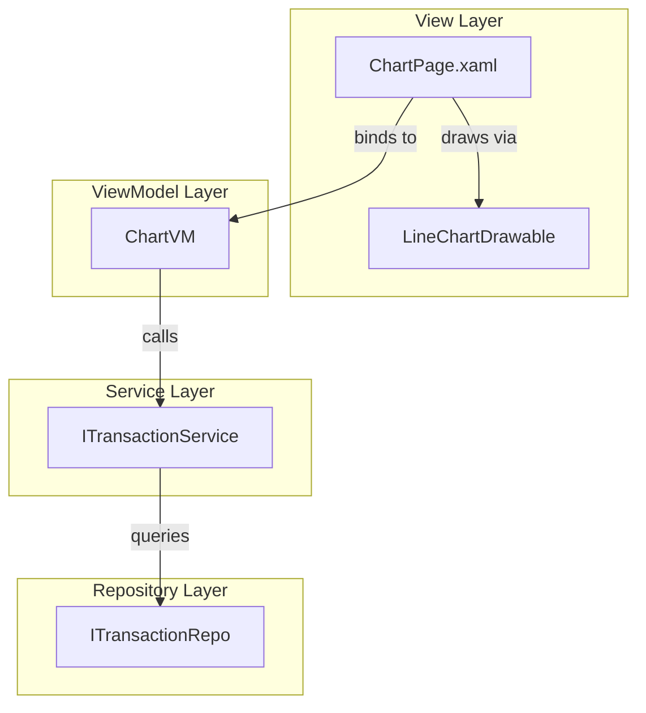

# Design Document: Annual Chart View

## Overview

This feature extends the existing `ChartPage` to support an annual viewing mode alongside the current monthly mode. The user toggles between "Mensal" and "Anual" scopes via a segmented control. In annual mode, the cumulative line chart renders 12 fixed data points (one per month, January–December), the period navigator moves year-by-year, and the "Incluir saldo anterior" checkbox is hidden. Both modes display a "Top 10 Maiores Despesas" ranked list replacing the full transaction list.

The design favours minimal structural change: the existing `ChartVM` gains a mode flag and a second data-loading path while the `LineChartDrawable` receives a generalized X-axis model. No new pages or services are introduced.

## Architecture



The existing layered architecture is preserved. Changes occur in:

1. **ChartVM** — new `IsAnnualMode` property, annual data-loading method, Top 10 computation.
2. **ChartPage.xaml** — scope toggle control, conditional visibility of the checkbox, Top 10 list section.
3. **LineChartDrawable** — generalized X-axis (supports both day-based and month-based rendering).
4. **ITransactionService / TransactionService** — new `GetByYear` method.
5. **ITransactionRepo / TransactionRepo** — new `GetByYear` query.

## Components and Interfaces

### ChartVM Extensions

```csharp
// New observable properties
[ObservableProperty] private bool isAnnualMode;
[ObservableProperty] private ObservableCollection<TransactionDTO> topExpenses = [];

// New computed property for X-axis point count
public int XAxisPointCount { get; private set; } // 12 for annual, DaysInMonth for monthly

// New labels for the X axis in annual mode
public string[] XAxisLabels { get; private set; }

// Commands
[RelayCommand] private async Task SetScope(bool annual);
[RelayCommand] private async Task LoadPreviousPeriod(); // replaces LoadPreviousMonth
[RelayCommand] private async Task LoadNextPeriod();     // replaces LoadNextMonth
```

**Design Decision:** Rather than creating a separate `AnnualChartVM`, the existing `ChartVM` is extended with a mode flag. Rationale: both modes share 80%+ of the logic (navigation, loading state, legend, data-changed event, transaction selection). A strategy pattern via a private helper method keeps the conditional logic contained without the overhead of two separate VMs.

**XAML Binding Update Required:** Renaming `LoadPreviousMonth`/`LoadNextMonth` to `LoadPreviousPeriod`/`LoadNextPeriod` means the generated `[RelayCommand]` properties change from `LoadPreviousMonthCommand`/`LoadNextMonthCommand` to `LoadPreviousPeriodCommand`/`LoadNextPeriodCommand`. The corresponding `Command="{Binding ...}"` attributes in `ChartPage.xaml` must be updated accordingly:
- `LoadPreviousMonthCommand` → `LoadPreviousPeriodCommand`
- `LoadNextMonthCommand` → `LoadNextPeriodCommand`

**Cancellation Token for Race Conditions:** Add a `private CancellationTokenSource? _loadCts;` field. Each call to `LoadChartAsync` or `LoadAnnualChartAsync` should:
1. Call `_loadCts?.Cancel()` to cancel any in-flight load.
2. Create a new `_loadCts = new CancellationTokenSource()`.
3. Pass `_loadCts.Token` to the async service calls.
4. Check `token.IsCancellationRequested` before applying results to properties.

This prevents race conditions when the user rapidly switches modes or taps navigation arrows — only the most recent request's results are applied to the UI.

### ITransactionService Extension

```csharp
Task<IEnumerable<TransactionDTO>> GetByYear(int year, int? accountId = null);
```

### ITransactionRepo Extension

```csharp
Task<IEnumerable<TransactionDTO>> GetByYear(int year, int? accountId = null);
```

### LineChartDrawable Generalization

The drawable currently uses `DaysInMonth` and maps `ChartPoint.Day` to X position. It will be generalized:

```csharp
// Replaces DaysInMonth — total number of points on the X axis
public int XAxisPointCount { get; set; } = 30;

// Optional labels for X-axis ticks (null = use numeric 1..XAxisPointCount)
public string[]? XAxisLabels { get; set; }
```

The `DayToX` mapping becomes a generalized `PointToX` that works uniformly with 1-based values in both modes. `ChartPoint.Day` always uses 1-based indexing:
- **Monthly mode:** Day = 1..DaysInMonth (day of month)
- **Annual mode:** Day = 1..12 (month number)

The formula: `(index - 1) / (float)(XAxisPointCount - 1) * plotW` — identical for both modes since both use 1-based values. No 0-based conversion is needed.

**X-axis label rendering:**
- When `XAxisLabels` is **null** (monthly mode), the existing step-based label logic MUST be preserved: show label at day 1, every ~5 days (step based on month length: step 2 for ≤15 days, step 4 for ≤20 days, step 5 otherwise), and always show the last day.
- When `XAxisLabels` is **not null** (annual mode), iterate through the array and render each label (Jan–Dez) at the corresponding X position.

### Top 10 Computation (in ChartVM)

```csharp
private void ComputeTop10(IEnumerable<TransactionDTO> transactions)
{
    var top = transactions
        .Where(t => t.Type == TransactionType.Expense && !t.Inactive)
        .OrderByDescending(t => Math.Abs(t.Amount))
        .ThenByDescending(t => t.Date)
        .Take(10)
        .ToList();

    TopExpenses = new ObservableCollection<TransactionDTO>(top);
}
```

## Data Models

### ChartPoint (existing, unchanged)

```csharp
public record ChartPoint(int Day, decimal Value);
```

In annual mode, `Day` represents the month index (1–12). In monthly mode, it continues to represent the day of the month.

### No new DTOs required

The existing `TransactionDTO` already contains all fields needed (Date, Amount, Type, Description, RecurringRuleId). The Top 10 list reuses the same `TransactionDTO` for item rendering.

### Annual Aggregation Logic

```
For each month M in 1..12:
    cumulativeIncome[M] = sum of Income amounts for months 1..M
    cumulativeExpense[M] = sum of |Expense amounts| for months 1..M

Result: two series of exactly 12 ChartPoints
```

The key difference from monthly mode: annual mode always produces 12 points (months with no transactions carry forward the previous cumulative value), while monthly mode only plots points on days that have at least one transaction.

## Correctness Properties

*A property is a characteristic or behavior that should hold true across all valid executions of a system — essentially, a formal statement about what the system should do. Properties serve as the bridge between human-readable specifications and machine-verifiable correctness guarantees.*

### Property 1: Annual series always produce exactly 12 data points

*For any* set of transactions (including an empty set) within a selected year, computing the annual chart data SHALL produce exactly 12 income points and exactly 12 expense points, one per calendar month.

**Validates: Requirements 3.1, 3.2, 3.5, 9.2**

### Property 2: Annual cumulative values are monotonically non-decreasing

*For any* set of non-negative Income or Expense transactions within a year, the cumulative income series and cumulative expense series SHALL be monotonically non-decreasing (each point >= the previous point), and the value at month M SHALL equal the sum of all relevant transactions from January through month M.

**Validates: Requirements 3.3**

### Property 3: Monthly points appear only on days with transactions

*For any* set of monthly transactions, the income series SHALL contain a data point for day D if and only if there exists at least one Income transaction on day D, and the expense series SHALL contain a data point for day D if and only if there exists at least one Expense transaction on day D.

**Validates: Requirements 4.2, 4.3**

### Property 4: Transfer transactions are excluded from chart series

*For any* set of transactions that includes Transfer-type transactions, the cumulative income and expense chart computations SHALL produce the same result as if the Transfer transactions did not exist, in both monthly and annual modes.

**Validates: Requirements 4.4, 9.3**

### Property 5: Year navigation advances or retreats by exactly 1

*For any* starting year Y and navigation direction (forward or backward), after N consecutive navigations in annual mode, the displayed year SHALL equal Y + N (forward) or Y − N (backward), and the period label SHALL be the 4-digit year string.

**Validates: Requirements 2.1, 2.2, 2.3**

### Property 6: IncludePreviousBalance round-trip across mode switches

*For any* boolean value of IncludePreviousBalance, switching from Monthly_Mode to Annual_Mode and back to Monthly_Mode SHALL preserve the persisted value without modification.

**Validates: Requirements 5.3, 5.5**

### Property 7: Annual mode ignores previous balance

*For any* set of transactions and any persisted value of IncludePreviousBalance (true or false), the annual chart computation SHALL produce cumulative series starting from zero — the previous balance SHALL NOT be applied.

**Validates: Requirements 5.4**

### Property 8: Top 10 list contains at most 10 items sorted by descending absolute amount

*For any* set of Expense transactions in the selected period, the Top 10 list SHALL contain min(10, count) items, sorted by absolute amount in descending order.

**Validates: Requirements 6.2, 6.7**

### Property 9: Top 10 list only includes Expense-type transactions

*For any* mixed set of transactions (Income, Expense, Transfer, Adjustment), the Top 10 list SHALL contain only items where Type == Expense.

**Validates: Requirements 6.3**

### Property 10: Top 10 list filters by active period

*For any* set of transactions spanning multiple months/years, the Top 10 list SHALL include only those Expense transactions whose Date falls within the currently selected period (month in Monthly_Mode, full year in Annual_Mode).

**Validates: Requirements 6.4, 6.5**

### Property 11: Top 10 secondary sort uses date descending for equal amounts

*For any* set of Expense transactions where two or more share the same absolute amount, the Top 10 list SHALL order those tied items by Date in descending order (most recent first).

**Validates: Requirements 6.10**

### Property 12: MaxValue is always at least 1

*For any* set of chart data points (including empty sets producing all-zero values), the MaxValue used for Y-axis scaling SHALL be >= 1.

**Validates: Requirements 9.4**

## Error Handling

| Scenario | Handling |
|----------|----------|
| `GetByYear` returns empty list | Both series render 12 zero-valued points; Top 10 shows empty-state message |
| Service call throws exception | `IsBusy` set to false in `finally` block; chart retains last loaded state |
| Mode switch during active load | Debounce via cancellation token — cancel previous load, start new one |
| Year navigation beyond data range | Allowed (renders zeros); no artificial year bounds imposed |
| Division by zero in Y-axis scaling | Prevented by `MaxValue = Math.Max(maxVal, 1)` guard |

## Testing Strategy

### Property-Based Tests (FsCheck.Xunit)

The project already uses **FsCheck.Xunit** (version 3.2.0) with xUnit. Property tests will target the pure computation logic extracted into testable methods.

**Configuration:**
- Minimum 100 iterations per property
- Each test tagged with: `// Feature: annual-chart-view, Property N: <description>`

**Target Methods for PBT:**
- `ComputeAnnualSeries(List<TransactionDTO> transactions)` → Properties 1, 2, 4, 7, 12
- `ComputeMonthlySeries(List<TransactionDTO> transactions, ...)` → Properties 3, 4
- `ComputeTop10(List<TransactionDTO> transactions, ...)` → Properties 8, 9, 10, 11
- Navigation state logic → Properties 5, 6

**Generators:**
- `Arb<List<TransactionDTO>>` — random transactions with varying types, dates, amounts
- `Arb<int>` for year (reasonable range: 2000–2099)
- `Arb<bool>` for IncludePreviousBalance

### Unit Tests (xUnit + NSubstitute)

- Mode defaults to Monthly on initialization
- Loading indicator is shown/hidden correctly around async operations
- Checkbox visibility toggles with mode
- Navigation command triggers correct service method
- Navigation to TransactionEditPage on item selection
- Legend content is static and unchanged across mode switches
- Annual mode X-axis labels match Portuguese abbreviations
- Period label format matches ("MMMM/yyyy" for monthly, "yyyy" for annual)

### Integration Tests

- `GetByYear` repo method returns correct transactions for a full calendar year
- Service layer correctly calls repo with year boundaries
- End-to-end flow: set annual mode → navigate year → verify data reload triggered
