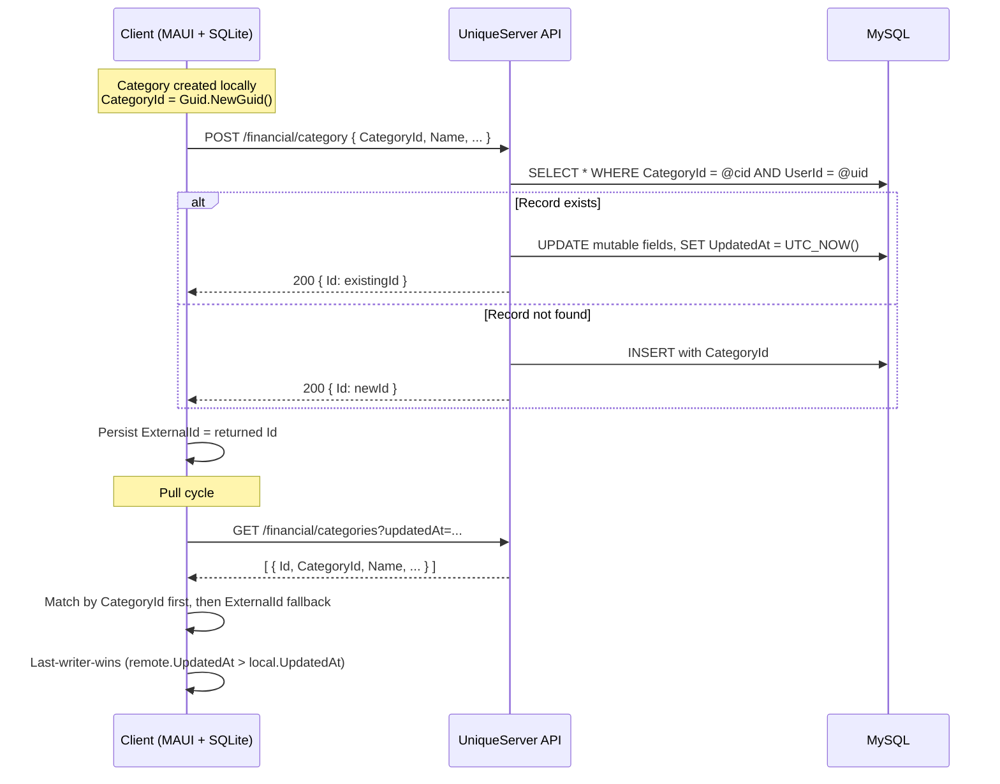
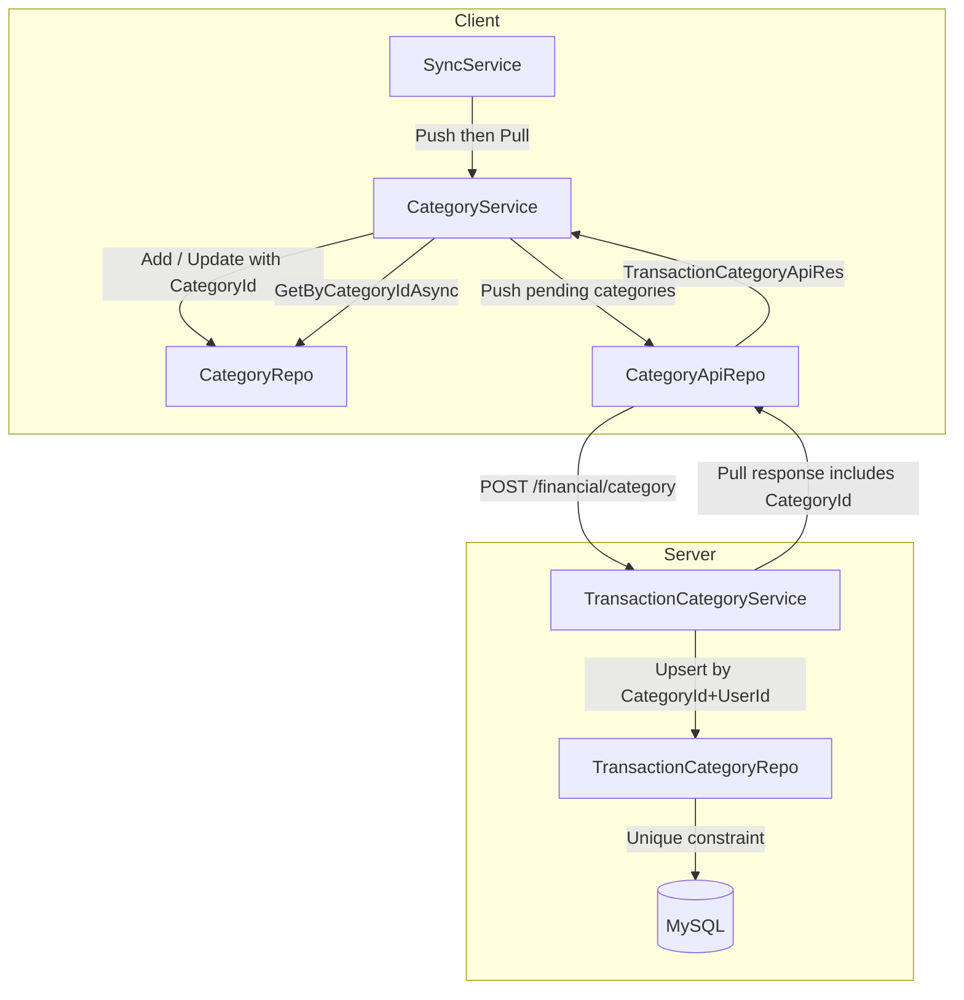

# Design Document: Category Guid Sync

## Overview

This design introduces a stable `CategoryId` (Guid) field across the XpemFinancial client and UniqueServer backend, enabling deterministic cross-device category matching. It also introduces a push flow (client → server) that currently does not exist — categories only support pull (server → client) today.

Categories are simpler than transactions: no `SyncStatus` state machine, no recurring rules, no installments, no deterministic Guid derivation. The push selection is straightforward: `CategoryId != Guid.Empty AND ExternalId == null`.

### Design Goals

1. **Guid-based matching** — Replace reliance on `ExternalId` for sync matching with a stable `CategoryId` assigned at creation.
2. **Push flow** — Enable client-created categories to reach the server and propagate to other devices.
3. **Incremental rollout** — `CategoryId` coexists with `ExternalId`; records with `Guid.Empty` fall back to current ExternalId-based behavior.
4. **No data loss** — Server migration backfills existing records; client migration defaults to `Guid.Empty`.

## Architecture



### High-Level Component Interaction



## Components and Interfaces

### Client-Side Changes

#### CategoryDTO (Model)

Add a `CategoryId` property of type `Guid`:

```csharp
[Table("Category")]
public class CategoryDTO : BaseDTO
{
    /// <summary>
    /// Stable cross-device identifier assigned at creation time.
    /// Used as the primary key for sync matching.
    /// Default: Guid.Empty for legacy records (backward-compatible).
    /// </summary>
    public Guid CategoryId { get; set; }

    // ... existing properties unchanged
    public string Name { get; set; }
    public int? ParentExternalId { get; set; }
    public bool IsMainCategory { get; set; }
    public int UserId { get; set; }
    public UserDTO User { get; set; }
    public bool SystemDefault { get; set; }
}
```

SQLite schema: non-nullable column, default `Guid.Empty` for existing rows.

#### CategoryRepo (Client)

New interface method:

```csharp
Task<CategoryDTO?> GetByCategoryIdAsync(Guid categoryId);
```

Implementation guards against `Guid.Empty` (returns null immediately without querying):

```csharp
public async Task<CategoryDTO?> GetByCategoryIdAsync(Guid categoryId)
{
    if (categoryId == Guid.Empty) return null;

    using var db = await DbCtx.CreateDbContextAsync();
    return await db.Category.FirstOrDefaultAsync(c => c.CategoryId == categoryId);
}
```

#### CategoryService (Client)

Modifications to:

- **AddLocalAsync**: Assign `Guid.NewGuid()` when `CategoryId == Guid.Empty`.
- **PushAsync** (new): Select pending categories (`CategoryId != Guid.Empty AND ExternalId == null`), POST each to server, persist returned `ExternalId`.
- **PullAsync** (modified): Match by `CategoryId` first (via `GetByCategoryIdAsync`), then fall back to `ExternalId`. Apply last-writer-wins on `UpdatedAt`.

```csharp
public interface ICategoryService
{
    Task<List<CategoryDTO>> GetAllAsync();
    Task UpsertAsync(CategoryDTO category);
    Task AddLocalAsync(CategoryDTO category);
    Task<DateTime> GetLastUpdatedAtAsync();
    Task PullAsync(int uid, DateTime lastUpdatedAt);
    Task PushAsync();  // NEW
}
```

**Push logic:**

```csharp
public async Task PushAsync()
{
    var pending = await categoryRepo.GetPendingPushAsync();
    foreach (var category in pending)
    {
        try
        {
            var response = await categoryApiRepo.PostCategoryAsync(new CategoryReq
            {
                CategoryId = category.CategoryId,
                Name = category.Name,
                IsMainTransactionCategory = category.IsMainCategory,
                ParentTransactionCategoryId = category.ParentExternalId,
                Inactive = category.Inactive,
                Color = null // client doesn't track color currently
            });

            if (response.Id > 0)
            {
                category.ExternalId = response.Id;
                await categoryRepo.UpdateAsync(category);
            }
        }
        catch
        {
            // Continue with remaining records — failed one retries next cycle
        }
    }
}
```

**Modified Pull logic (matching):**

```csharp
foreach (var apiCategory in apiRes)
{
    CategoryDTO? local = null;

    // 1. Match by CategoryId if present
    if (apiCategory.CategoryId is not null && apiCategory.CategoryId != Guid.Empty)
        local = await categoryRepo.GetByCategoryIdAsync(apiCategory.CategoryId.Value);

    // 2. Fallback to ExternalId
    if (local is null && apiCategory.Id > 0)
        local = await categoryRepo.GetByExternalIdAsync(apiCategory.Id);

    if (local is not null)
    {
        // Last-writer-wins
        if (apiCategory.UpdatedAt > local.UpdatedAt)
        {
            local.Name = apiCategory.Name;
            local.Inactive = apiCategory.Inactive;
            local.SystemDefault = apiCategory.SystemDefault;
            local.IsMainCategory = apiCategory.IsMainTransactionCategory;
            local.ParentExternalId = apiCategory.ParentTransactionCategoryId;
            local.ExternalId = apiCategory.Id;
            local.UpdatedAt = apiCategory.UpdatedAt;
            if (apiCategory.CategoryId is not null && apiCategory.CategoryId != Guid.Empty)
                local.CategoryId = apiCategory.CategoryId.Value;
            await categoryRepo.UpdateAsync(local);
        }
    }
    else
    {
        // Insert new record
        await categoryRepo.AddAsync(new CategoryDTO
        {
            CategoryId = apiCategory.CategoryId ?? Guid.Empty,
            ExternalId = apiCategory.Id,
            Name = apiCategory.Name,
            // ... map remaining fields
        });
    }
}
```

#### CategoryRepo — GetPendingPushAsync (New)

```csharp
Task<List<CategoryDTO>> GetPendingPushAsync();
```

Implementation:

```csharp
public async Task<List<CategoryDTO>> GetPendingPushAsync()
{
    using var db = await DbCtx.CreateDbContextAsync();
    return await db.Category
        .Where(c => c.CategoryId != Guid.Empty && c.ExternalId == null)
        .ToListAsync();
}
```

#### CategoryApiRepo (Client)

Add push method:

```csharp
public interface ICategoryApiRepo
{
    Task<ApiResp> GetByLastUpdateAsync(DateTime lastUpdate, int page);
    Task<CategoryPushRes> PostCategoryAsync(CategoryReq req);  // NEW
}
```

Implementation uses the existing `AuthRequestAsync` pattern with `RequestsTypes.Post`.

#### CategoryReq (Client Request Model — New)

```csharp
public record CategoryReq
{
    public Guid? CategoryId { get; set; }
    public required string Name { get; set; }
    public bool IsMainTransactionCategory { get; set; }
    public int? ParentTransactionCategoryId { get; set; }
    public bool Inactive { get; set; }
    public string? Color { get; set; }
}
```

#### CategoryPushRes (Client Response Model — New)

```csharp
public record CategoryPushRes
{
    public int Id { get; set; }
}
```

#### TransactionCategoryApiRes (Client — Modified)

Add `CategoryId` field:

```csharp
public record TransactionCategoryApiRes
{
    public int Id { get; set; }
    public Guid? CategoryId { get; set; }  // NEW
    public DateTime UpdatedAt { get; set; }
    public bool SystemDefault { get; set; }
    public required string Name { get; set; }
    public bool Inactive { get; set; }
    public string? Color { get; set; }
    public bool IsMainTransactionCategory { get; set; }
    public int? ParentTransactionCategoryId { get; set; }
}
```

### Server-Side Changes

#### TransactionCategoryDTO (Server Model)

Add:

```csharp
/// <summary>
/// Stable cross-device identifier. Nullable during transition period.
/// Unique constraint scoped to UserId.
/// </summary>
public Guid? CategoryId { get; set; }
```

MySQL schema: nullable `CHAR(36)` column with a composite unique index on `(CategoryId, UserId)` where `CategoryId IS NOT NULL`.

#### TransactionCategoryReq (Server — New)

```csharp
public record TransactionCategoryReq : BaseReq
{
    /// <summary>
    /// Stable cross-device identifier. Nullable for backward compatibility.
    /// </summary>
    public Guid? CategoryId { get; set; }

    [StringLength(50)]
    public required string Name { get; set; }

    public bool IsMainTransactionCategory { get; set; }

    public int? ParentTransactionCategoryId { get; set; }

    public bool Inactive { get; set; }

    [StringLength(8)]
    public string? Color { get; set; }
}
```

#### TransactionCategoryRes (Server — Modified)

Add:

```csharp
public Guid? CategoryId { get; set; }  // NEW
```

#### TransactionCategoryRepo (Server)

New interface method:

```csharp
Task<TransactionCategoryDTO?> FindByCategoryIdAsync(Guid categoryId, int userId);
Task<TransactionCategoryDTO> AddAsync(TransactionCategoryDTO dto);
Task UpdateAsync(TransactionCategoryDTO dto);
```

Implementation:

```csharp
public async Task<TransactionCategoryDTO?> FindByCategoryIdAsync(Guid categoryId, int userId)
{
    if (categoryId == Guid.Empty) return null;

    using var context = await dbCtx.CreateDbContextAsync();
    return await context.TransactionCategory
        .FirstOrDefaultAsync(c => c.CategoryId == categoryId && c.UserId == userId);
}
```

#### TransactionCategoryService (Server)

Add upsert method:

```csharp
public interface ITransactionCategoryService
{
    Task<List<TransactionCategoryRes>> GetByUid(int uid, DateTime updatedAt);
    Task<TransactionCategoryUpsertRes> UpsertAsync(TransactionCategoryReq req, int uid);  // NEW
}
```

Upsert logic:

```csharp
public async Task<TransactionCategoryUpsertRes> UpsertAsync(TransactionCategoryReq req, int uid)
{
    if (req.CategoryId is not null && req.CategoryId != Guid.Empty)
    {
        var existing = await repo.FindByCategoryIdAsync(req.CategoryId.Value, uid);
        if (existing is not null)
        {
            // UPDATE
            existing.Name = req.Name;
            existing.IsMainTransactionCategory = req.IsMainTransactionCategory;
            existing.ParentTransactionCategoryId = req.ParentTransactionCategoryId;
            existing.Inactive = req.Inactive;
            existing.Color = req.Color;
            existing.UpdatedAt = DateTime.UtcNow;
            await repo.UpdateAsync(existing);
            return new TransactionCategoryUpsertRes { Id = existing.Id };
        }
        else
        {
            // INSERT with provided CategoryId
            var dto = new TransactionCategoryDTO
            {
                CategoryId = req.CategoryId,
                Name = req.Name,
                IsMainTransactionCategory = req.IsMainTransactionCategory,
                ParentTransactionCategoryId = req.ParentTransactionCategoryId,
                Inactive = req.Inactive,
                Color = req.Color,
                UserId = uid,
                CreatedAt = DateTime.UtcNow,
                UpdatedAt = DateTime.UtcNow
            };
            var inserted = await repo.AddAsync(dto);
            return new TransactionCategoryUpsertRes { Id = inserted.Id };
        }
    }
    else
    {
        // No CategoryId — generate one, insert
        var dto = new TransactionCategoryDTO
        {
            CategoryId = Guid.NewGuid(),
            Name = req.Name,
            IsMainTransactionCategory = req.IsMainTransactionCategory,
            ParentTransactionCategoryId = req.ParentTransactionCategoryId,
            Inactive = req.Inactive,
            Color = req.Color,
            UserId = uid,
            CreatedAt = DateTime.UtcNow,
            UpdatedAt = DateTime.UtcNow
        };
        var inserted = await repo.AddAsync(dto);
        return new TransactionCategoryUpsertRes { Id = inserted.Id };
    }
}
```

#### TransactionCategoryUpsertRes (Server — New)

```csharp
public record TransactionCategoryUpsertRes
{
    public int Id { get; set; }
}
```

#### FinancialController (Server — New Endpoint)

```csharp
[HttpPost]
[Route("category")]
public async Task<IActionResult> AddCategory([FromBody] TransactionCategoryReq req)
{
    var validationError = req.Validate();
    if (validationError is not null) return BadRequest(validationError);

    var result = await transactionCategoryService.UpsertAsync(req, Uid);
    return Ok(result);
}
```

#### Database Migration (Server)

EF Core migration:
1. Add nullable `CategoryId` column (`CHAR(36)`).
2. Backfill: `UPDATE TransactionCategory SET CategoryId = UUID() WHERE CategoryId IS NULL`.
3. Add composite unique index on `(CategoryId, UserId)` where `CategoryId IS NOT NULL`.

```sql
ALTER TABLE `TransactionCategory` ADD COLUMN `CategoryId` CHAR(36) NULL;
UPDATE `TransactionCategory` SET `CategoryId` = UUID() WHERE `CategoryId` IS NULL;
CREATE UNIQUE INDEX `IX_TransactionCategory_CategoryId_UserId`
    ON `TransactionCategory` (`CategoryId`, `UserId`);
```

#### GetByUid Response Mapping (Server — Modified)

The existing `GetByUid` mapping must include `CategoryId` in the response:

```csharp
return [.. categories.Select(c => new TransactionCategoryRes
{
    Id = c.Id,
    CategoryId = c.CategoryId,  // NEW
    UpdatedAt = c.UpdatedAt,
    SystemDefault = c.SystemDefault,
    Name = c.Name,
    Inactive = c.Inactive,
    Color = c.Color,
    IsMainTransactionCategory = c.IsMainTransactionCategory,
    ParentTransactionCategoryId = c.ParentTransactionCategoryId
})];
```

## Data Models

### Client SQLite Schema Change

```sql
ALTER TABLE "Category" ADD COLUMN "CategoryId" TEXT NOT NULL DEFAULT '00000000-0000-0000-0000-000000000000';
```

No unique index is needed on the client side — `CategoryId` uniqueness is enforced server-side. The client uses it for lookup only.

### Server MySQL Schema Change

```sql
ALTER TABLE `TransactionCategory` ADD COLUMN `CategoryId` CHAR(36) NULL;
UPDATE `TransactionCategory` SET `CategoryId` = UUID() WHERE `CategoryId` IS NULL;
CREATE UNIQUE INDEX `IX_TransactionCategory_CategoryId_UserId`
    ON `TransactionCategory` (`CategoryId`, `UserId`);
```

### Sync Flow Summary

| State | `CategoryId` | `ExternalId` | Behavior |
|-------|-------------|-------------|----------|
| Created locally, not yet pushed | `!= Guid.Empty` | `null` | Selected for push |
| Pushed successfully | `!= Guid.Empty` | `> 0` | Excluded from push; matched by CategoryId on pull |
| Legacy record (pre-migration) | `Guid.Empty` | `> 0` | Matched by ExternalId on pull; NOT selected for push |
| Pulled from server (new record) | `!= Guid.Empty` | `> 0` | Inserted with both identifiers |

## Correctness Properties

*A property is a characteristic or behavior that should hold true across all valid executions of a system — essentially, a formal statement about what the system should do. Properties serve as the bridge between human-readable specifications and machine-verifiable correctness guarantees.*

### Property 1: Guid Assignment on Creation

*For any* category created locally with `CategoryId == Guid.Empty`, after `AddLocalAsync` completes, the persisted record SHALL have a `CategoryId != Guid.Empty`.

**Validates: Requirements 1.2, 10.1, 10.2**

### Property 2: Server Upsert Idempotence

*For any* `CategoryId` and `UserId` pair, pushing the same category N times (N ≥ 1) SHALL result in exactly one record in the server database with that `CategoryId`-`UserId` combination. The mutable fields SHALL reflect the last request's values, and the response SHALL always contain the same auto-increment `Id`.

**Validates: Requirements 4.1, 4.2, 4.3, 4.5**

### Property 3: Push Round-Trip Preserves Identity

*For any* local category with `CategoryId != Guid.Empty`, the push request payload SHALL contain that `CategoryId`. When the server responds with `Id > 0`, the local record SHALL have `ExternalId` set to that value and SHALL be excluded from subsequent pending-push queries.

**Validates: Requirements 3.1, 3.2, 6.3**

### Property 4: Pull CategoryId Matching with Last-Writer-Wins

*For any* pulled category with a non-null, non-empty `CategoryId` that matches a local record, the local record SHALL be updated if and only if the pulled `UpdatedAt` is strictly greater than the local `UpdatedAt`. The local record's `CategoryId` SHALL equal the pulled value.

**Validates: Requirements 5.1, 5.2, 1.3, 7.3**

### Property 5: Pull Fallback and Insert

*For any* pulled category whose `CategoryId` does not match any local record, the system SHALL fall back to matching by `ExternalId`. If neither matches, a new local record SHALL be inserted. If `CategoryId` is null or empty, the system SHALL match by `ExternalId` only.

**Validates: Requirements 5.3, 5.4, 5.5**

### Property 6: Push Selection Criteria

*For any* set of local categories, `GetPendingPushAsync` SHALL return exactly those records where `CategoryId != Guid.Empty AND ExternalId == null`. Records with `Guid.Empty` (regardless of `ExternalId`) or with a valid `ExternalId` SHALL be excluded.

**Validates: Requirements 6.2, 7.5**

### Property 7: Client Repository Lookup Correctness

*For any* `CategoryId != Guid.Empty`, `GetByCategoryIdAsync` SHALL return the matching record if one exists, or null otherwise. *For* `Guid.Empty`, it SHALL return null without querying the database.

**Validates: Requirements 8.2, 8.3, 8.4**

### Property 8: Server Repository Lookup Correctness

*For any* `CategoryId != Guid.Empty` and `UserId`, `FindByCategoryIdAsync` SHALL return the matching record (including inactive records) if one exists for that user, or null otherwise. *For* `Guid.Empty`, it SHALL return null without querying the database.

**Validates: Requirements 9.2, 9.3, 9.4**

## Error Handling

| Scenario | Behavior | Recovery |
|----------|----------|----------|
| Server unavailable during push | Keep record without `ExternalId` (remains pending) | Next sync cycle retries push |
| Local DB write fails after successful push | `ExternalId` not persisted (remains pending) | Next push is deduplicated by server upsert |
| Concurrent push of same CategoryId | MySQL unique constraint prevents duplicate; second request updates existing | Both clients eventually get same `ExternalId` |
| Pull receives category with unknown CategoryId | Insert as new local record | Normal operation |
| Push of single record fails in batch | Continue with remaining records | Failed record retries next cycle |
| Guid.Empty in CategoryId on push request | Should never occur (selection criteria excludes these) | If it does, server generates a new Guid |
| Legacy client sends request without CategoryId | Server inserts with auto-generated Guid | Existing behavior preserved |
| Pull response with null CategoryId | Match by ExternalId only | Backward-compatible with pre-migration server |

## Testing Strategy

### Property-Based Testing (PBT)

This feature is well-suited for property-based testing because:
- The sync logic involves deterministic pure functions (matching decisions, selection criteria, upsert semantics)
- Behavior varies meaningfully with input (different CategoryId values, timestamps, ExternalId presence/absence)
- The input space is large (Guid × DateTime × nullable ExternalId)

**Library**: [FsCheck](https://fscheck.github.io/FsCheck/) for .NET (integrates with xUnit)

**Configuration**: Minimum 100 iterations per property test.

**Tag format**: `Feature: category-guid-sync, Property {number}: {property_text}`

Each correctness property (1–8) maps to a single property-based test. Generators produce:
- Random `Guid` values (including `Guid.Empty` as edge case)
- Random `DateTime` values
- Random nullable `int?` for ExternalId (including null and positive values)
- Random category fields (Name, IsMainCategory, etc.)

### Unit Tests (Example-Based)

- Backward compatibility: request with null `CategoryId` triggers server-side Guid generation (Req 4.4)
- Pull with null `CategoryId` uses ExternalId-only matching (Req 5.5)
- Server returns failure → category remains pending for retry (Req 3.3)
- Push batch continues when one record fails (Req 6.4)
- Sync cycle invokes push before pull (Req 6.1)

### Integration Tests

- Server migration backfills all NULL CategoryId rows (Req 2.6)
- Concurrent push with same CategoryId + unique constraint enforcement (Req 4.6)
- End-to-end push/pull cycle between two simulated devices

### Smoke Tests

- Schema validation: CategoryId column exists with correct type and default (Req 1.1, 1.4, 2.1, 2.2)
- DTO properties exist with correct types (Req 2.3, 2.4, 3.4, 8.1, 9.1, 9.5)
