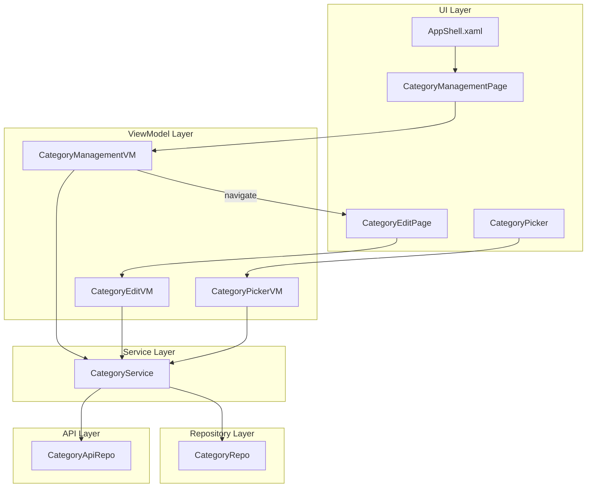

# Design Document: Category Management

## Overview

This feature introduces a dedicated Category Management Page (`CategoryManagementPage`) accessible from the AppShell flyout sidebar. It allows users to view their full category hierarchy (including system-default and inactive items), edit user-created category names, and toggle the `Inactive` flag (soft-delete) with cascading logic for parent/child relationships.

The design reuses existing infrastructure:
- **CategoryDTO / BaseDTO** — The data model already has `Inactive`, `UpdatedAt`, `CategoryId`, `ExternalId`, `IsMainCategory`, `ParentExternalId`, and `SystemDefault` fields.
- **CategoryService** — Existing `GetAllAsync`, `PushAsync`, and `AddLocalAsync` methods. A new `UpdateLocalAsync` method will be added.
- **CategoryEditPage / CategoryEditVM** — Adapted to support editing (currently only supports creation).
- **CategoryPicker / CategoryPickerVM** — Modified to filter out inactive categories.

The key design decision is to keep category management logic in a new `CategoryManagementVM` ViewModel (following the `AccountsVM` pattern), while extending `CategoryEditVM` to handle edit mode via query parameters.

## Architecture



**Navigation Flow:**
1. User taps "Categorias" FlyoutItem → Shell navigates to `CategoryManagementPage`
2. User taps edit on a category → Shell navigates to `CategoryEditPage` with `categoryId` query param
3. User taps inactivate/reactivate → `CategoryManagementVM` handles inline with confirmation dialog

## Components and Interfaces

### New Components

#### CategoryManagementPage (View)
- XAML page following the `AccountsPage` pattern
- Displays categorized lists with swipe actions or context menus for edit/inactivate/reactivate
- Uses `BoldConverter` and `IndentConverter` for hierarchy display
- Shows "Sistema" badge for `SystemDefault` categories
- Applies `Opacity="0.6"` for inactive categories

#### CategoryManagementVM (ViewModel)
```csharp
public partial class CategoryManagementVM(
    ICategoryService categoryService,
    IUserSessionService userSessionService) : VMBase
{
    [ObservableProperty] private List<CategoryDisplayItem> categories;
    [ObservableProperty] private bool hasNoCategories;

    Task InitializeAsync();
    Task InactivateCategory(CategoryDTO category);
    Task ReactivateCategory(CategoryDTO category);
    Task EditCategory(CategoryDTO category);
}
```

#### CategoryDisplayItem (Display Model)
A lightweight wrapper or the DTO itself enhanced with display metadata for the grouped list.

### Modified Components

#### CategoryEditVM — Edit Mode Support
- Accept `categoryId` query parameter via `IQueryAttributable`
- When `categoryId` is present: load existing category, pre-populate fields, change save logic to update instead of create
- Block type change (Main → Sub) when the main category has active subcategories
- Title changes to "Editar Categoria" in edit mode

#### CategoryPickerVM — Inactive Filtering
- Filter `_cachedCategories` to exclude items where `Inactive == true`
- Active subcategories of inactive parents remain visible

#### ICategoryService — New Method
```csharp
Task UpdateLocalAsync(CategoryDTO category);
```
Updates a category locally and triggers `PushAsync`.

### Service Layer Changes

#### CategoryService.UpdateLocalAsync
```csharp
public async Task UpdateLocalAsync(CategoryDTO category)
{
    category.UpdatedAt = DateTime.UtcNow;
    await categoryRepo.UpdateAsync(category);
}
```

#### CategoryService.GetAllGroupedAsync (new helper)
Returns categories grouped hierarchically for the management page:
- Main categories sorted alphabetically
- Under each main: active subcategories alphabetically, then inactive subcategories alphabetically
- Inactive main categories and their subcategories at the end of the list

## Data Models

### Existing: CategoryDTO (no schema changes)
```csharp
public class CategoryDTO : BaseDTO
{
    public Guid CategoryId { get; set; }
    public int? ExternalId { get; set; }
    public string Name { get; set; }
    public int? ParentExternalId { get; set; }
    public bool IsMainCategory { get; set; }
    public int UserId { get; set; }
    public bool SystemDefault { get; set; }
    // Inherited from BaseDTO:
    // int Id, int? ExternalId, DateTime CreatedAt, DateTime UpdatedAt, bool Inactive
}
```

### Display Model: CategoryDisplayItem
```csharp
public class CategoryDisplayItem
{
    public CategoryDTO Category { get; set; }
    public bool IsMainCategory => Category.IsMainCategory;
    public bool IsInactive => Category.Inactive;
    public bool IsSystemDefault => Category.SystemDefault;
    public bool CanEdit => !IsSystemDefault;
    public bool CanInactivate => !IsSystemDefault && !IsInactive;
    public bool CanReactivate => !IsSystemDefault && IsInactive;
}
```

### Grouping/Sorting Logic

The hierarchical sorting algorithm for the management page:

```
Input: List<CategoryDTO> allCategories
Output: List<CategoryDisplayItem> sorted

1. Separate into main categories and subcategories
2. Sort main categories: active first (alphabetical), then inactive (alphabetical)
3. For each main category:
   a. Add the main category to output
   b. Find its subcategories (where ParentExternalId == main.ExternalId)
   c. Sort subcategories: active first (alphabetical), then inactive (alphabetical)
   d. Add sorted subcategories to output
4. Handle orphan subcategories (no matching parent) at the end
```

## Correctness Properties

*A property is a characteristic or behavior that should hold true across all valid executions of a system — essentially, a formal statement about what the system should do. Properties serve as the bridge between human-readable specifications and machine-verifiable correctness guarantees.*

### Property 1: Hierarchical sorting preserves grouping and ordering invariants

*For any* list of categories with varying names, hierarchy relationships, and inactive flags, the grouped output SHALL place each main category immediately before its subcategories, with active items sorted alphabetically before inactive items within each group, and main category groups sorted alphabetically by the main category's name.

**Validates: Requirements 2.1, 2.5**

### Property 2: Cascading inactivation

*For any* active main category that has N active subcategories, inactivating the main category SHALL result in the main category and all N subcategories having `Inactive == true` and `UpdatedAt` set to the current UTC timestamp.

**Validates: Requirements 3.2, 3.4**

### Property 3: Cascading reactivation

*For any* inactive subcategory whose parent main category is also inactive, reactivating the subcategory SHALL result in both the subcategory and its parent having `Inactive == false` and `UpdatedAt` set to the current UTC timestamp.

**Validates: Requirements 4.1, 4.2**

### Property 4: Whitespace-only names are rejected

*For any* string composed entirely of whitespace characters (spaces, tabs, newlines), attempting to save a category with that name SHALL be rejected and the category's persisted state SHALL remain unchanged.

**Validates: Requirements 5.3**

### Property 5: Name trimming on save

*For any* valid category name with leading or trailing whitespace, saving the category SHALL persist the name with all leading and trailing whitespace removed, and SHALL set `UpdatedAt` to the current UTC timestamp.

**Validates: Requirements 5.4**

### Property 6: Type change blocked for parents with active children

*For any* main category that has at least one active subcategory (Inactive == false), the system SHALL prevent changing `IsMainCategory` to false (i.e., converting it to a subcategory).

**Validates: Requirements 5.6**

### Property 7: Category Picker excludes all inactive categories

*For any* set of categories, the Category Picker's displayed list SHALL contain only categories where `Inactive == false`, regardless of whether their parent is active or inactive.

**Validates: Requirements 6.1, 6.2**

### Property 8: Pending push query correctness

*For any* set of categories with varying `CategoryId` and `ExternalId` values, the pending push query SHALL return exactly those categories where `CategoryId != Guid.Empty` AND `ExternalId == null`.

**Validates: Requirements 7.2**

### Property 9: Push outcome correctly updates ExternalId

*For any* batch of pending categories where the API succeeds for some and fails for others, each successfully pushed category SHALL have its `ExternalId` set to the server-returned value, each failed category SHALL retain `ExternalId == null`, and all categories in the batch SHALL be attempted regardless of individual failures.

**Validates: Requirements 7.3, 7.4**

## Error Handling

| Scenario | Handling |
|----------|----------|
| Category load failure | Show snackbar "Erro ao carregar categorias" via `VMBase.ShowMessage`, display empty state |
| Inactivation/reactivation persistence failure | Show snackbar with error message, revert in-memory state |
| PushAsync network failure | Swallowed per-category (existing behavior) — failed items retry next sync cycle |
| Edit save with empty name | Validation message "Informe um nome para a categoria", no navigation |
| Edit save persistence failure | Show snackbar with error message, remain on edit page |
| Category with no ExternalId (orphan parent lookup) | Handle gracefully — display subcategory without parent grouping |

## Testing Strategy

### Property-Based Tests (FsCheck.Xunit)

The project already uses **FsCheck.Xunit** (v3.2.0) with xUnit in the `RecurringTests` project. All property-based tests will follow the same pattern:

- **Library**: FsCheck.Xunit 3.2.0
- **Framework**: xUnit 2.9.3
- **Mocking**: NSubstitute 5.3.0
- **Minimum iterations**: 100 per property (FsCheck default)
- **Tag format**: `// Feature: category-management, Property {N}: {description}`

Each correctness property (1–9) maps to a single `[Property]` test method.

### Unit Tests (xUnit)

Example-based tests for:
- Confirmation dialog display on inactivation (3.1)
- Cancel dialog leaves state unchanged (3.3)
- System categories don't show edit/inactivate/reactivate actions (3.6, 4.4, 5.7)
- Navigation to CategoryEditPage with correct query param (5.1)
- Pre-population of edit fields (5.2)
- Transaction display preserves inactive category name (6.3)
- Picker doesn't pre-select inactive category on transaction edit (6.4)

### Integration Tests

- Sync push triggers after inactivation/reactivation/edit (3.5, 4.3, 5.5)
- Full round-trip: inactivate → sync → reactivate → sync

### Test Project Location

Tests will be added to the existing `RecurringTests` project (or a new `CategoryTests` folder within it), following the established folder-per-domain convention (e.g., `RecurringTests/CategoryTests/`).
