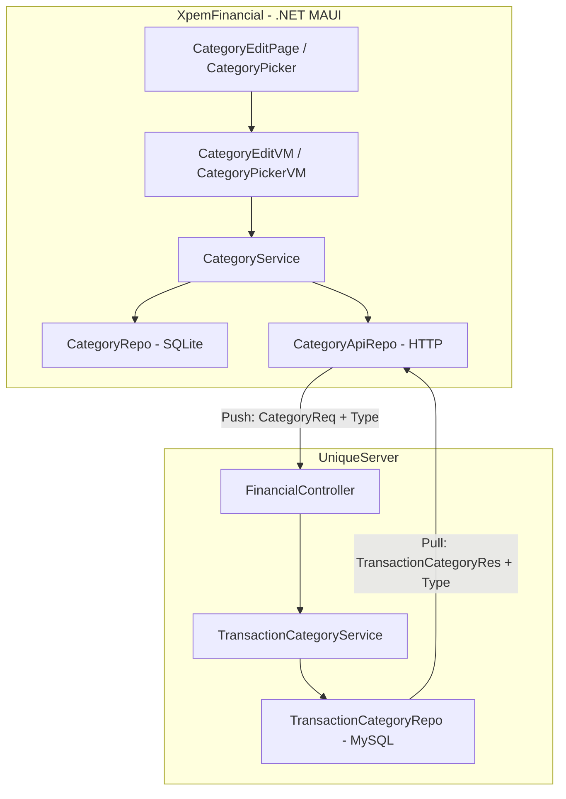

# Design Document: Category Type Classification

## Overview

This feature adds a `CategoryType` classification to categories, enabling context-aware filtering in the CategoryPicker based on transaction type. The design spans two codebases (client: XpemFinancial/.NET MAUI, server: UniqueServer) and integrates with the existing Pull/Push sync flow.

The core change is a new `Type` property on category models (client `CategoryDTO`, server `TransactionCategoryDTO`) backed by a `CategoryType` enum with values `Income = 0`, `Expense = 1`, `Both = 2`. Subcategories inherit their type from their parent MainCategory, and the CategoryPicker filters its list based on the transaction type being created or edited.

### Key Design Decisions

1. **Shared enum values, separate enum definitions**: The `CategoryType` enum is defined independently on client and server with identical names and integer backing values. This avoids a shared library dependency between the two separate repositories while ensuring serialization compatibility via integer mapping.

2. **Default value `Both = 2`**: Existing categories default to `Both`, making them universally visible. This ensures zero disruption to existing users during rollout.

3. **Version-aware schema migration on client**: The client uses a version-based drop-and-recreate migration strategy (see `BuildDbService`). Adding the `Type` column to `CategoryDTO` with EF Core model configuration and incrementing `CurrentDbVersion` triggers a full recreate on next launch. Data is then repopulated via the pull sync flow from the server (which already has the correct types persisted via its own migration).

4. **Subcategory inheritance enforced at service layer**: Rather than denormalizing inheritance into the database, the service layer enforces that subcategories always carry their parent's type. This keeps the single source of truth at the MainCategory level.

## Architecture



### Data Flow

1. **Create/Edit**: User selects a CategoryType in `CategoryEditVM` → `CategoryService` validates and persists locally → `PushAsync()` sends `CategoryReq` with `Type` field to server.
2. **Pull Sync**: Server returns `TransactionCategoryRes` with `Type` integer → client maps to `CategoryType` enum on `CategoryDTO`.
3. **Picker Filtering**: `CategoryPickerVM` receives `TransactionType` context → filters cached categories by matching `CategoryType` (Income shows Income+Both, Expense shows Expense+Both, Transfer/Adjustment shows all).

## Components and Interfaces

### New Types

#### `CategoryType` Enum (Client - Model project)

```csharp
namespace Model.DTO;

public enum CategoryType
{
    Income = 0,
    Expense = 1,
    Both = 2
}
```

#### `CategoryType` Column (Server - FinancialService)

Added as an `int` property on `TransactionCategoryDTO` (no separate enum on server to keep it simple — validation via range check):

```csharp
// On TransactionCategoryDTO
public int Type { get; set; } = 2; // Default: Both
```

### Modified Components

| Component | Change |
|-----------|--------|
| `CategoryDTO` (client) | Add `public CategoryType Type { get; set; } = CategoryType.Both;` |
| `TransactionCategoryDTO` (server) | Add `public int Type { get; set; } = 2;` |
| `CategoryReq` (client) | Add `public int? Type { get; set; }` |
| `TransactionCategoryReq` (server) | Add `public int? Type { get; set; }` |
| `TransactionCategoryApiRes` (client) | Add `public int? Type { get; set; }` |
| `TransactionCategoryRes` (server) | Add `public int Type { get; set; }` |
| `CategoryService.PullAsync` | Map `Type` field from API response to local DTO (default to `Both` if null/invalid) |
| `CategoryService.PushAsync` | Include `Type` integer in `CategoryReq` |
| `TransactionCategoryService.UpsertAsync` (server) | Persist `Type` field; validate range [0,2]; preserve existing if field absent |
| `TransactionCategoryService.GetByUid` (server) | Include `Type` in response mapping |
| `CategoryPickerVM` | Accept `TransactionType` parameter; filter categories by compatible `CategoryType` |
| `CategoryEditVM` | Add Type selector for MainCategory; show read-only inherited type for subcategories |
| `CategoryEditVM.Save` | Cascade type to subcategories on MainCategory type change |
| `BuildDbService` | Increment `CurrentDbVersion` (22 → 23) |
| `DbCtx.OnModelCreating` | Configure `CategoryDTO.Type` default value |

### CategoryPickerVM Filtering Logic

```csharp
public static List<CategoryDTO> FilterByTransactionType(
    List<CategoryDTO> categories, 
    TransactionType? transactionType)
{
    if (transactionType is null 
        || transactionType == TransactionType.Transfer 
        || transactionType == TransactionType.Adjustment)
        return categories;

    var targetType = transactionType == TransactionType.Income
        ? CategoryType.Income
        : CategoryType.Expense;

    return categories
        .Where(c => c.Type == targetType || c.Type == CategoryType.Both)
        .ToList();
}
```

### Subcategory Type Inheritance Logic (CategoryService)

```csharp
public async Task UpdateMainCategoryTypeAsync(CategoryDTO mainCategory, CategoryType newType)
{
    mainCategory.Type = newType;
    mainCategory.UpdatedAt = DateTime.UtcNow;
    await categoryRepo.UpdateAsync(mainCategory);

    // Cascade to active subcategories
    var all = await categoryRepo.GetAllAsync();
    var subcategories = all.Where(c => 
        !c.IsMainCategory 
        && !c.Inactive 
        && c.ParentExternalId == mainCategory.ExternalId);

    foreach (var sub in subcategories)
    {
        sub.Type = newType;
        sub.UpdatedAt = DateTime.UtcNow;
        await categoryRepo.UpdateAsync(sub);
    }
}
```

### Server-Side Validation (TransactionCategoryService)

```csharp
// In UpsertAsync, after resolving insert vs update:
if (req.Type.HasValue)
{
    if (req.Type.Value < 0 || req.Type.Value > 2)
        throw new ArgumentException("Invalid category type value.");
    dto.Type = req.Type.Value;
}
// If req.Type is null (older client): preserve existing value or default to 2
```

## Data Models

### Client-Side: CategoryDTO (Updated)

```csharp
[Table("Category")]
public class CategoryDTO : BaseDTO
{
    public Guid CategoryId { get; set; }
    public int? ExternalId { get; set; }
    [StringLength(50)]
    public string Name { get; set; }
    public int? ParentExternalId { get; set; }
    public bool IsMainCategory { get; set; }
    public int UserId { get; set; }
    public UserDTO User { get; set; }
    public bool SystemDefault { get; set; }
    public CategoryType Type { get; set; } = CategoryType.Both; // NEW
}
```

### Server-Side: TransactionCategoryDTO (Updated)

```csharp
[Table("TransactionCategory")]
public class TransactionCategoryDTO
{
    public int Id { get; set; }
    public required DateTime CreatedAt { get; set; }
    public DateTime UpdatedAt { get; set; } = DateTime.Now;
    public bool SystemDefault { get; set; } = false;
    public int? UserId { get; set; }
    [MaxLength(50)]
    public required string Name { get; set; }
    public bool Inactive { get; set; } = false;
    [MaxLength(8)]
    public string? Color { get; set; }
    public bool IsMainTransactionCategory { get; set; }
    public int? ParentTransactionCategoryId { get; set; }
    public Guid? CategoryId { get; set; }
    public int Type { get; set; } = 2; // NEW - Default: Both
}
```

### Sync Payloads

**Push (Client → Server): CategoryReq**
```csharp
public record CategoryReq
{
    public Guid? CategoryId { get; set; }
    [Required][StringLength(50, MinimumLength = 1)]
    public required string Name { get; set; }
    public bool IsMainTransactionCategory { get; set; }
    public int? ParentTransactionCategoryId { get; set; }
    public bool Inactive { get; set; }
    [StringLength(8)]
    public string? Color { get; set; }
    public int? Type { get; set; } // NEW - nullable for backward compat
}
```

**Pull (Server → Client): TransactionCategoryApiRes**
```csharp
public record TransactionCategoryApiRes
{
    public int Id { get; set; }
    public Guid? CategoryId { get; set; }
    public DateTime UpdatedAt { get; set; }
    public bool SystemDefault { get; set; }
    public required string Name { get; set; }
    public bool Inactive { get; set; }
    public string? Color { get; set; }
    public bool IsMainTransactionCategory { get; set; }
    public int? ParentTransactionCategoryId { get; set; }
    public int? Type { get; set; } // NEW - nullable for old servers
}
```

### Server Migration (MySQL)

```sql
ALTER TABLE TransactionCategory ADD COLUMN Type INT NOT NULL DEFAULT 2;
UPDATE TransactionCategory SET Type = 2 WHERE Type = 2; -- no-op, ensures default applied
```

Using EF Core migration in `FinancialService/Migrations/`:
```csharp
migrationBuilder.AddColumn<int>(
    name: "Type",
    table: "TransactionCategory",
    type: "int",
    nullable: false,
    defaultValue: 2);
```

### Client Migration Strategy

The client uses a version-stamp approach (`BuildDbService.CurrentDbVersion`). Incrementing from 22 → 23 causes the local SQLite database to be dropped and recreated with the updated EF model (which now includes `CategoryType Type`). All data is then repopulated on the next sync pull. This is the established pattern in the project — no incremental ALTER TABLE is needed on the client.

### SystemDefault Category Type Assignments

| Category | Type |
|----------|------|
| Receita | Income |
| Alimentação | Expense |
| Carro | Expense |
| Casa | Expense |
| Educação | Expense |
| Doações | Expense |
| Eletrônicos | Expense |
| Presentes | Expense |
| Pessoais | Expense |
| Impostos | Expense |
| Lazer | Expense |
| Saúde | Expense |
| Seguro | Expense |
| Transporte | Expense |
| Investimentos | Expense |
| Sem categoria | Both |
| Outros | Both |

These assignments are applied via a server-side data migration script or seed update that sets the `Type` column and bumps `UpdatedAt` so clients pick up the change on next pull.


## Correctness Properties

*A property is a characteristic or behavior that should hold true across all valid executions of a system — essentially, a formal statement about what the system should do. Properties serve as the bridge between human-readable specifications and machine-verifiable correctness guarantees.*

### Property 1: CategoryType enum serialization round-trip

*For any* valid `CategoryType` enum member, casting it to `int` and then casting back to `CategoryType` shall produce the original enum member. Additionally, the integer representation used on the client must equal the integer stored/transmitted by the server for the same logical type.

**Validates: Requirements 1.3**

### Property 2: Subcategory inherits parent Type on creation

*For any* MainCategory with any `CategoryType` value, and *for any* new subcategory created under that MainCategory, the subcategory's `Type` property shall equal the parent MainCategory's `Type` immediately after creation.

**Validates: Requirements 2.5, 5.1**

### Property 3: MainCategory type change cascades to active subcategories

*For any* MainCategory with one or more active subcategories, and *for any* new `CategoryType` value assigned to that MainCategory, all active (non-inactive) subcategories of that MainCategory shall have their `Type` updated to match the new parent type after the change is persisted.

**Validates: Requirements 5.2**

### Property 4: Re-parenting subcategory updates its Type

*For any* existing subcategory and *for any* new parent MainCategory with a potentially different `CategoryType`, after re-parenting the subcategory, its `Type` shall equal the new parent MainCategory's `Type`.

**Validates: Requirements 5.3**

### Property 5: CategoryPicker filters by compatible Type for Income and Expense contexts

*For any* list of active categories with varying `CategoryType` values, when the CategoryPicker is opened with an Income transaction context, all returned categories shall have `Type == Income` or `Type == Both`. Symmetrically, when opened with an Expense context, all returned categories shall have `Type == Expense` or `Type == Both`. No categories with incompatible types shall appear in the filtered list.

**Validates: Requirements 7.1, 7.2**

### Property 6: CategoryPicker shows all active categories for Transfer, Adjustment, or null context

*For any* list of active categories, when the CategoryPicker is opened with a Transfer context, an Adjustment context, or no transaction type context (null), the returned list shall contain all active categories regardless of their `CategoryType` value.

**Validates: Requirements 7.3, 7.4, 11.4**

### Property 7: Push/Pull sync round-trip preserves Type

*For any* `CategoryDTO` with a valid `CategoryType`, pushing it to the server (serializing `Type` as an integer in `CategoryReq`) and then pulling the same category back (deserializing the integer from `TransactionCategoryApiRes`) shall result in a local `CategoryDTO` whose `Type` equals the original value.

**Validates: Requirements 8.1, 8.2, 9.1, 9.2**

### Property 8: Server rejects invalid Type values

*For any* integer value not in the set {0, 1, 2}, when included as the `Type` field in a category upsert request to the server, the server shall reject the request with an error response.

**Validates: Requirements 8.3**

### Property 9: Server preserves existing Type when request omits it

*For any* existing category on the server that has a `Type` value in {0, 1, 2}, when an upsert request is received without a `Type` field (null), the server shall preserve the category's existing `Type` value without overwriting it. For new categories without a `Type` field, the server shall default to `Both` (2).

**Validates: Requirements 11.1, 11.3**

### Property 10: MainCategory creation requires Type selection

*For any* MainCategory creation attempt where no `CategoryType` has been selected (Type is unset/null), the system shall reject the save operation. Conversely, *for any* MainCategory creation with a valid `CategoryType` selected, the save shall succeed (assuming other validations pass).

**Validates: Requirements 2.4, 6.4**

## Error Handling

| Scenario | Handling |
|----------|----------|
| Server receives `Type` outside {0, 1, 2} | Return HTTP 400 with error message "Invalid category type value" |
| Client pulls `Type` that is null | Map to `CategoryType.Both` (defensive default) |
| Client pulls `Type` outside valid range | Map to `CategoryType.Both` (defensive default) |
| Subcategory save with unresolvable parent | Prevent save, display validation message ("Selecione uma categoria pai válida") |
| MainCategory save without Type selected | Prevent save, display validation message ("Selecione um tipo para a categoria") |
| Type cascade fails mid-way (e.g., repo exception) | Let exception propagate; caller (VM) catches and shows error message. Partial updates are acceptable since next push/pull will reconcile |
| Older client pushes without Type field | Server treats as null → preserves existing Type or defaults to Both for new records |
| Database migration failure (server) | EF Core migration rolls back the transaction; no partial schema state |

### Client-Side Defensive Mapping

```csharp
public static CategoryType SafeParseCategoryType(int? value)
{
    return value switch
    {
        0 => CategoryType.Income,
        1 => CategoryType.Expense,
        2 => CategoryType.Both,
        _ => CategoryType.Both // null or out-of-range → default
    };
}
```

## Testing Strategy

### Property-Based Tests (FsCheck.Xunit)

The project already uses **FsCheck.Xunit** (v3.2.0) with **xUnit** for property-based testing. Each property below maps to a correctness property from the design.

| Property # | Test Class | What It Tests |
|-----------|-----------|--------------|
| 1 | `CategoryTypeSerializationPropertyTests` | Enum ↔ int round-trip for all valid values |
| 2 | `SubcategoryTypeInheritancePropertyTests` | Subcategories get parent's Type on creation |
| 3 | `TypeCascadePropertyTests` | Changing MainCategory Type cascades to active children |
| 4 | `ReparentTypeUpdatePropertyTests` | Re-parenting updates subcategory Type |
| 5 | `PickerFilterByTypePropertyTests` | Income/Expense filter returns only compatible types |
| 6 | `PickerUnfilteredPropertyTests` | Transfer/Adjustment/null context returns all |
| 7 | `SyncRoundTripTypePropertyTests` | Push then Pull preserves CategoryType |
| 8 | `ServerRejectsInvalidTypePropertyTests` | Server rejects Type ∉ {0,1,2} |
| 9 | `ServerPreservesTypeOnNullPropertyTests` | Null Type in request preserves existing |
| 10 | `MainCategoryRequiresTypePropertyTests` | Save rejected when Type not selected |

**Configuration**: Each property test runs with `[Property(MaxTest = 100)]` minimum.

**Tag format**: `// Feature: category-type-classification, Property {N}: {title}`

### Unit Tests (Example-Based)

| Test | What It Verifies |
|------|-----------------|
| `CategoryType_DefaultsTo_Both` | New CategoryDTO has Type == Both |
| `CategoryEditVM_ShowsReadOnlyType_ForSubcategory` | Subcategory edit displays inherited type read-only |
| `CategoryEditVM_ShowsTypeSelector_ForMainCategory` | MainCategory edit shows editable selector |
| `CategoryEditVM_NoPreselection_OnCreate` | New MainCategory has no Type pre-selected |
| `CategoryPickerVM_EmptyState_WhenNoMatchingCategories` | Shows empty message when filter yields zero results |
| `PullAsync_NullType_DefaultsToBoth` | Pulled category with null Type gets Both |
| `PullAsync_OutOfRangeType_DefaultsToBoth` | Pulled category with Type=5 gets Both |
| `SystemDefaultCategories_HaveCorrectTypes` | Verifies assignment table from Req 10 |

### Integration Tests

| Test | What It Verifies |
|------|-----------------|
| `ServerMigration_AddsTypeColumn_WithDefault` | MySQL migration adds column correctly |
| `SyncPush_IncludesTypeInPayload` | End-to-end push sends Type to server |
| `SyncPull_MapsTypeFromServer` | End-to-end pull maps Type correctly |
| `OlderClient_PushWithoutType_ServerPreservesExisting` | Backward compat on server |

### Test Organization

All new test classes go in `RecurringTests/CategoryTests/` following the existing naming convention (e.g., `*PropertyTests.cs` for PBT, `*Tests.cs` for unit/integration tests).
