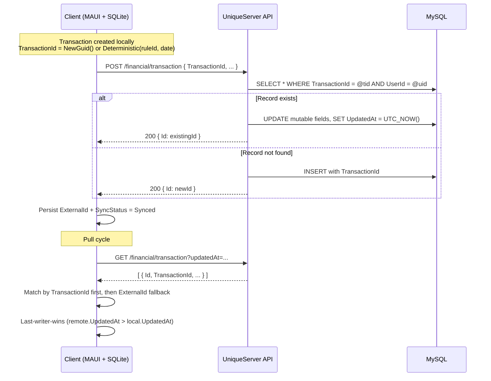
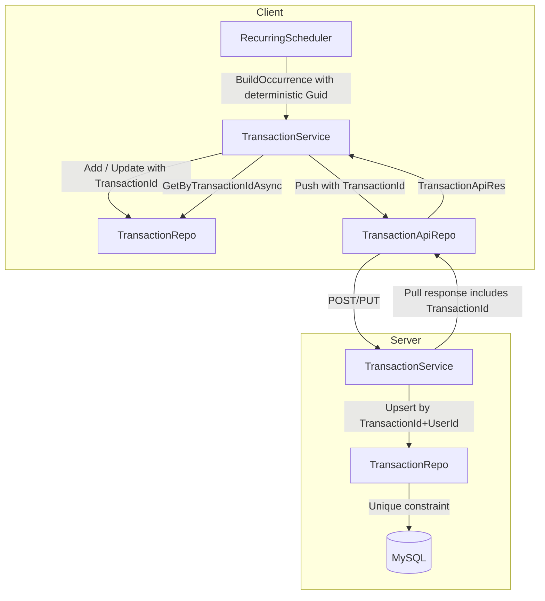
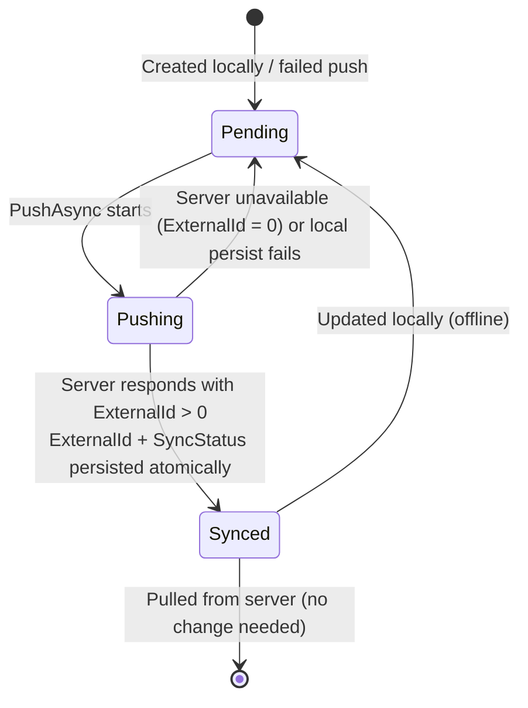

# Design Document: Transaction Guid Sync

## Overview

This design introduces a stable `TransactionId` (Guid) field across the XpemFinancial client and UniqueServer backend, replacing heuristic-based deduplication with deterministic Guid-based matching. The change touches four layers: data models, repository lookups, service-level sync logic, and the recurring scheduler.

The key insight is that each transaction receives a Guid at creation time (client-generated or server-assigned), and this Guid becomes the canonical cross-device identifier. For recurring occurrences, the Guid is derived deterministically from the rule ID and date, ensuring all devices converge on the same identifier without coordination.

### Design Goals

1. **Deterministic deduplication** — Replace the fragile 5-minute-window heuristic with exact Guid matching.
2. **Eliminate sync loops** — Recurring occurrences get a deterministic Guid so the server's upsert recognizes them on every push cycle.
3. **Incremental rollout** — `TransactionId` coexists with `ExternalId`; older clients (or records with `Guid.Empty`) fall back to the current behavior.
4. **No data loss** — Server migration backfills existing records; client migration defaults to `Guid.Empty`.

## Architecture



### High-Level Component Interaction



## Components and Interfaces

### Client-Side Changes

#### TransactionDTO (Model)

Add a `TransactionId` property of type `Guid`:

```csharp
[Table("Transaction")]
public class TransactionDTO : BaseDTO
{
    /// <summary>
    /// Stable cross-device identifier assigned at creation time.
    /// Used as the primary key for sync matching.
    /// Default: Guid.Empty for legacy records (backward-compatible).
    /// </summary>
    public Guid TransactionId { get; set; }

    // ... existing properties unchanged
}
```

SQLite schema: non-nullable column with a unique index, default `Guid.Empty` for existing rows.

#### TransactionRepo (Client)

New interface method:

```csharp
Task<TransactionDTO?> GetByTransactionIdAsync(Guid transactionId);
```

Implementation guards against `Guid.Empty` (returns null immediately without querying).

#### TransactionService (Client)

Modifications to:
- **AddAsync / AddOccurrenceAsync**: Assign `Guid.NewGuid()` when `TransactionId == Guid.Empty`.
- **PushAsync**: Include `TransactionId` in the `TransactionReq` payload.
- **ApplyFromApiAsync** (pull): Match by `TransactionId` first (via `GetByTransactionIdAsync`), then fall back to `ExternalId`. Apply last-writer-wins only when `SyncStatus != Pushing`.

#### TransactionApiRepo (Client)

No interface changes. The existing `PostAsync` and `PutAsync` already serialize `TransactionReq`, which will now include `TransactionId`. The `TransactionApiRes` model gains a `TransactionId` field.

#### TransactionReq (Client Model)

Add:
```csharp
public Guid? TransactionId { get; set; }
```

#### TransactionApiRes (Client Model)

Add:
```csharp
public Guid? TransactionId { get; set; }
```

#### RecurringScheduler

Modify `BuildOccurrence` to generate a deterministic `TransactionId` from `RecurringRuleId` + occurrence date using a UUID v5 / SHA-256 approach. Check for existing occurrence by `TransactionId` before inserting.

### Server-Side Changes

#### TransactionDTO (Server Model)

Add:
```csharp
/// <summary>
/// Stable cross-device identifier. Nullable during transition period.
/// Unique constraint scoped to UserId.
/// </summary>
public Guid? TransactionId { get; set; }
```

MySQL schema: nullable `CHAR(36)` or `BINARY(16)` column with a composite unique index on `(TransactionId, UserId)` where `TransactionId IS NOT NULL`.

#### TransactionReq (Server Model)

Add:
```csharp
public Guid? TransactionId { get; set; }
```

#### TransactionRes (Server Model)

Add:
```csharp
public Guid TransactionId { get; set; }
```

The field is non-nullable in responses because the server backfills/generates Guids for all records.

#### TransactionRepo (Server)

New interface method:

```csharp
Task<TransactionDTO?> FindByTransactionIdAsync(Guid transactionId, int userId);
```

Implementation uses the composite index `(TransactionId, UserId)` and guards against `Guid.Empty`.

#### TransactionService (Server)

Modify `AddAsync` to implement upsert logic:

```
if (req.TransactionId != null && req.TransactionId != Guid.Empty)
    existing = await repo.FindByTransactionIdAsync(req.TransactionId.Value, uid)
    if (existing != null) → UPDATE existing, return existing.Id
    else → INSERT with req.TransactionId, return new.Id
else
    → fall through to existing FindDuplicateAsync heuristic
```

#### Database Migration (Server)

EF Core migration:
1. Add nullable `TransactionId` column.
2. Run SQL to backfill: `UPDATE Transaction SET TransactionId = UUID() WHERE TransactionId IS NULL`.
3. Add composite unique index on `(TransactionId, UserId)` with a filter `WHERE TransactionId IS NOT NULL`.

### Deterministic Guid Derivation

For recurring occurrences, `TransactionId` is derived deterministically:

```csharp
public static class DeterministicGuid
{
    // Fixed namespace UUID (generated once, never changed)
    private static readonly Guid Namespace = new("a1b2c3d4-e5f6-7890-abcd-ef1234567890");

    /// <summary>
    /// Derives a deterministic Guid from a RecurringRuleId and an occurrence date.
    /// Uses SHA-256 truncated to 16 bytes with version/variant bits set per RFC 4122 (v5-style).
    /// </summary>
    public static Guid FromRecurringRule(Guid recurringRuleId, DateTime occurrenceDate)
    {
        // Input: namespace bytes + ruleId bytes + date-only ISO string bytes
        // Output: first 16 bytes of SHA-256 hash with UUID v5 version/variant bits
        var dateOnly = occurrenceDate.Date.ToString("yyyy-MM-dd");
        // ... SHA-256 hash, truncate, set version bits
    }
}
```

This guarantees:
- Same `RecurringRuleId` + same date → same `TransactionId` on any device.
- Different rules or dates → different `TransactionId` (collision probability negligible with SHA-256).

## Data Models

### Client SQLite Schema Change

```sql
ALTER TABLE "Transaction" ADD COLUMN "TransactionId" TEXT NOT NULL DEFAULT '00000000-0000-0000-0000-000000000000';
CREATE UNIQUE INDEX "IX_Transaction_TransactionId" ON "Transaction" ("TransactionId") WHERE "TransactionId" != '00000000-0000-0000-0000-000000000000';
```

The unique index excludes `Guid.Empty` rows so legacy records don't conflict.

### Server MySQL Schema Change

```sql
ALTER TABLE `Transaction` ADD COLUMN `TransactionId` CHAR(36) NULL;
UPDATE `Transaction` SET `TransactionId` = UUID() WHERE `TransactionId` IS NULL;
CREATE UNIQUE INDEX `IX_Transaction_TransactionId_UserId` ON `Transaction` (`TransactionId`, `UserId`);
```

### Sync State Machine



## Correctness Properties

*A property is a characteristic or behavior that should hold true across all valid executions of a system — essentially, a formal statement about what the system should do. Properties serve as the bridge between human-readable specifications and machine-verifiable correctness guarantees.*

### Property 1: Guid Assignment on Creation

*For any* new transaction created via AddAsync or AddOccurrenceAsync with `TransactionId == Guid.Empty`, the persisted record SHALL have a `TransactionId != Guid.Empty`. Similarly, *for any* server-side creation where `TransactionReq.TransactionId` is null, the stored record SHALL have a non-empty `TransactionId`.

**Validates: Requirements 1.2, 2.5**

### Property 2: Server Upsert Idempotence

*For any* `TransactionId` and `UserId` pair, pushing the same transaction N times (N ≥ 1) SHALL result in exactly one record in the server database with that `TransactionId`-`UserId` combination. The mutable fields SHALL reflect the last request's values, and the response SHALL always contain the same auto-increment `Id`.

**Validates: Requirements 4.2, 4.3, 4.5**

### Property 3: Push Round-Trip Preserves Identity

*For any* local transaction with a non-empty `TransactionId`, the `TransactionReq` payload sent to the server SHALL contain that `TransactionId`. When the server responds with `ExternalId > 0`, the local record SHALL have that `ExternalId` persisted.

**Validates: Requirements 3.1, 3.2**

### Property 4: Pull TransactionId Matching with Last-Writer-Wins

*For any* pulled transaction with a non-empty `TransactionId` that matches a local record whose `SyncStatus != Pushing`, the local record SHALL be updated if and only if the pulled `UpdatedAt` is strictly greater than the local `UpdatedAt`. The local record's `TransactionId` SHALL equal the pulled value.

**Validates: Requirements 5.2, 1.3, 8.3**

### Property 5: Pull Skips Records in Pushing State

*For any* pulled transaction whose `TransactionId` matches a local record with `SyncStatus == Pushing`, the local record SHALL remain unchanged after the pull operation.

**Validates: Requirements 5.3**

### Property 6: Pull Inserts New Records

*For any* pulled transaction with a `TransactionId` that has no local match (neither by `TransactionId` nor by `ExternalId`), the client SHALL insert a new local record with `SyncStatus = Synced` and the pulled `TransactionId` populated.

**Validates: Requirements 5.5**

### Property 7: Deterministic Recurring TransactionId

*For any* `RecurringRuleId` (not `Guid.Empty`) and occurrence date (not `default(DateTime)`), calling the deterministic derivation function multiple times SHALL always produce the same byte-identical `TransactionId`. Furthermore, *for any* two distinct `(RecurringRuleId, date)` pairs, the derived `TransactionId` values SHALL differ.

**Validates: Requirements 6.1, 6.2**

### Property 8: Recurring Occurrence Deduplication

*For any* recurring rule and date whose derived `TransactionId` already exists in the local database, the scheduler SHALL not create a new record. The total number of records with that `TransactionId` SHALL remain exactly one.

**Validates: Requirements 6.3**

### Property 9: Atomic ExternalId Persist After Push

*For any* recurring occurrence successfully pushed (server returned `ExternalId > 0`), the local record SHALL have both `ExternalId` set to the returned value AND `SyncStatus == Synced` after the operation completes. `GetPendingPushAsync` SHALL not return this record on subsequent calls.

**Validates: Requirements 7.1, 7.3**

### Property 10: Backward Compatibility — Guid.Empty Falls Back to ExternalId

*For any* transaction with `TransactionId == Guid.Empty` and a valid `ExternalId`, sync operations (push and pull) SHALL use `ExternalId` as the matching key. The record SHALL NOT appear in `GetPendingPushAsync` solely because its `TransactionId` is empty (when `SyncStatus == Synced`).

**Validates: Requirements 8.1, 8.6**

### Property 11: Client Repository Lookup Correctness

*For any* `TransactionId != Guid.Empty`, `GetByTransactionIdAsync` SHALL return the matching record (including inactive records) if one exists, or null otherwise. *For* `Guid.Empty`, it SHALL return null without querying the database.

**Validates: Requirements 9.2, 9.3, 9.4**

### Property 12: Server Repository Lookup Correctness

*For any* `TransactionId != Guid.Empty` and `UserId`, `FindByTransactionIdAsync` SHALL return the matching record (including inactive records) if one exists for that user, or null otherwise. *For* `Guid.Empty`, it SHALL return null without querying the database.

**Validates: Requirements 10.2, 10.3, 10.4**

## Error Handling

| Scenario | Behavior | Recovery |
|----------|----------|----------|
| Server unavailable during push (ExternalId = 0) | Keep `SyncStatus = Pending` | Next sync cycle retries push |
| Local DB write fails after successful push | Keep `SyncStatus = Pending` | Next push is deduplicated by server upsert |
| Concurrent push of same TransactionId | MySQL unique constraint prevents duplicate; second request updates existing | Both clients eventually get same ExternalId |
| Pull receives transaction with unknown TransactionId | Insert as new local record | Normal operation |
| Pull receives transaction while local is Pushing | Skip update | Push completes, next pull reconciles |
| Deterministic Guid collision (SHA-256 truncation) | Astronomically unlikely (2^-128) | If occurred, upsert updates existing record — no data loss |
| Guid.Empty in RecurringRuleId or default date | Skip occurrence generation | Log warning, continue with next date |
| Legacy client sends request without TransactionId | Server falls back to FindDuplicateAsync heuristic | Existing behavior preserved |

## Testing Strategy

### Property-Based Testing (PBT)

This feature is well-suited for property-based testing because:
- The sync logic is deterministic pure functions (Guid derivation, matching decisions, upsert semantics)
- Behavior varies meaningfully with input (different TransactionId values, timestamps, SyncStatus combinations)
- The input space is large (Guid × DateTime × SyncStatus × presence/absence)

**Library**: [FsCheck](https://fscheck.github.io/FsCheck/) for .NET (integrates with xUnit)

**Configuration**: Minimum 100 iterations per property test.

**Tag format**: `Feature: transaction-guid-sync, Property {number}: {property_text}`

Each correctness property (1–12) maps to a single property-based test. Generators produce:
- Random `Guid` values (including `Guid.Empty` as edge case)
- Random `DateTime` values (including `default(DateTime)` as edge case)
- Random `TransactionSyncStatus` values
- Random transaction fields (description, amount, date, etc.)

### Unit Tests (Example-Based)

- Backward compatibility: request with null `TransactionId` triggers `FindDuplicateAsync` (Req 4.4)
- Pull with null `TransactionId` uses ExternalId-only matching (Req 5.6)
- Server returns ExternalId = 0 → SyncStatus stays Pending (Req 7.4)
- Local DB persist failure → SyncStatus stays Pending (Req 7.5)
- Pull fallback from TransactionId miss → ExternalId match (Req 5.4)

### Integration Tests

- Server migration backfills all NULL TransactionId rows (Req 2.6)
- Concurrent push with same TransactionId + unique constraint enforcement (Req 4.6)
- End-to-end push/pull cycle between two simulated devices

### Smoke Tests

- Schema validation: TransactionId column exists with correct type and index (Req 1.4, 2.2, 4.7, 10.5)
- DTO properties exist with correct types (Req 1.1, 2.1, 2.3, 2.4, 9.1, 10.1)
