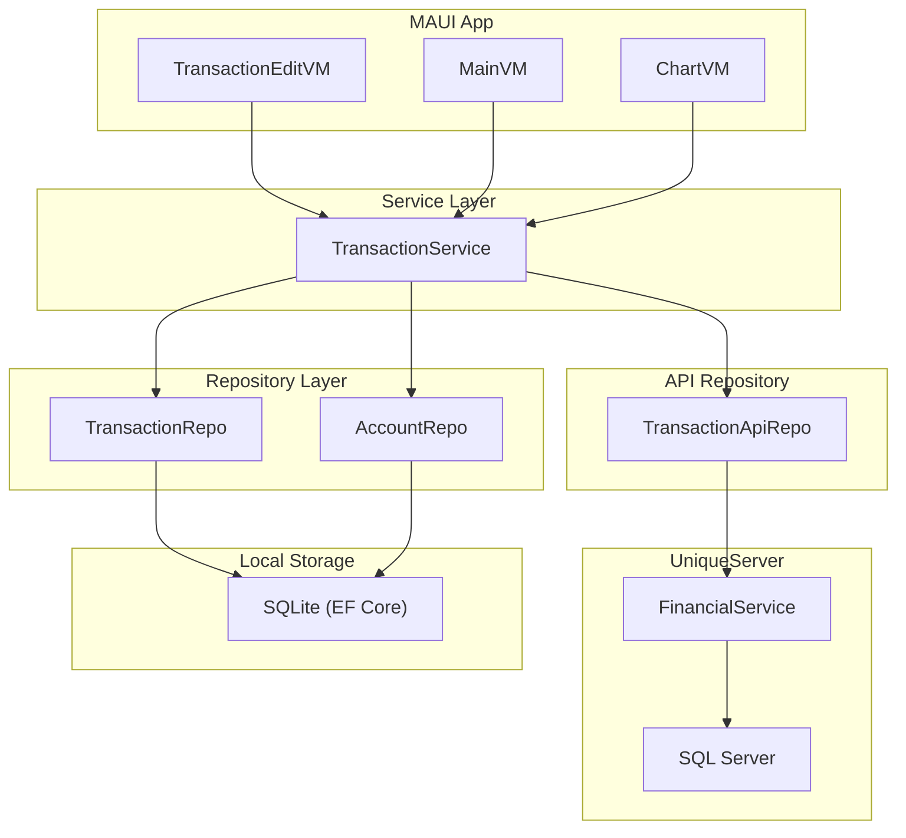
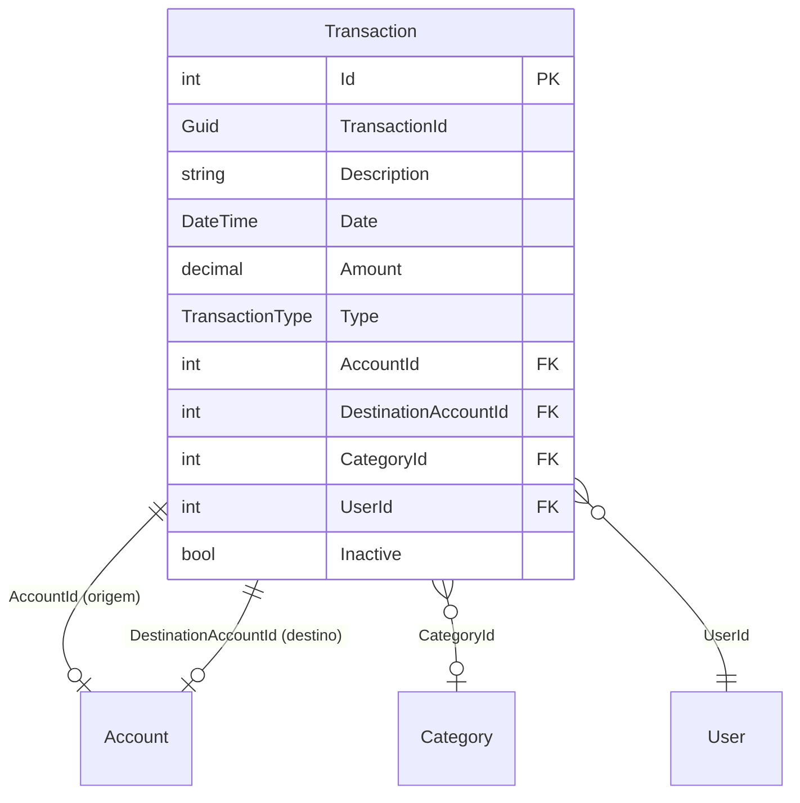

# Design Document: Transfer Transactions

## Overview

Esta feature implementa a funcionalidade de transferências entre contas no XpemFinancial. Uma transferência é uma movimentação interna de dinheiro entre duas contas do mesmo usuário — ela não altera o patrimônio total, apenas redistribui saldo.

O modelo adotado é de **registro único**: cada transferência é representada por uma única linha no banco de dados, contendo tanto a conta de origem (`AccountId`) quanto a conta de destino (`DestinationAccountId`). Esta decisão simplifica edição, exclusão e sincronização em comparação com modelos de dois registros vinculados.

### Decisões de Design Principais

1. **Registro único vs. par de registros**: Optou-se pelo registro único para simplificar a lógica de edição/exclusão e evitar inconsistências de dados quando um dos registros do par falha durante a sincronização.

2. **Amount sempre negativo**: O valor é armazenado como negativo (saída da conta de origem). O impacto na conta de destino é calculado invertendo o sinal (`-Amount`). Isso mantém consistência com o modelo existente onde despesas são negativas.

3. **CategoryId nulo**: Transferências não possuem categoria, pois não representam receita nem despesa real.

4. **Neutralidade em totais**: Transferências são excluídas dos cálculos de Income/Expense nos Totais e nos gráficos, mas participam do cálculo de saldo anterior por conta individual.

## Architecture

A feature se integra na arquitetura existente em camadas do XpemFinancial:



### Fluxo de Dados

1. **Criação**: `TransactionEditVM` → `TransactionService.AddAsync()` → persiste localmente → push ao servidor
2. **Edição**: `TransactionEditVM` → `TransactionService.UpdateAsync()` → recalcula saldos das contas afetadas → push
3. **Exclusão**: `TransactionEditVM` → `TransactionService.DeleteAsync()` → soft-delete (Inactive=true) → recalcula saldos → push
4. **Sincronização**: Pull do servidor → `ApplyFromApiAsync()` resolve `DestinationAccountId` externo para local → recalcula saldos

## Components and Interfaces

### Alterações no TransactionDTO (Model Layer)

Adição de uma nova propriedade ao `TransactionDTO` existente:

```csharp
public int? DestinationAccountId { get; set; }

[NotMapped]
public int? DestinationAccountExternalId { get; set; }

[ForeignKey("DestinationAccountId")]
public AccountDTO? DestinationAccount { get; set; }
```

### Alterações no TransactionReq (API Request Model)

Adição do campo para sincronização:

```csharp
public int? DestinationAccountId { get; set; }
```

### Alterações no TransactionApiRes (API Response Model)

Adição do campo para recebimento do servidor:

```csharp
public int? DestinationAccountId { get; set; }
```

### Alterações no TransactionService

```csharp
// Novos comportamentos em AddAsync:
// - Se Type == Transfer: Amount = -Math.Abs(amount), CategoryId = null
// - Validar DestinationAccountId != AccountId
// - Recalcular saldo da DestinationAccount além da Account

// Novos comportamentos em UpdateAsync:
// - Detectar mudança de DestinationAccountId (oldDestination vs new)
// - Reverter impacto na DestinationAccount anterior
// - Aplicar impacto na nova DestinationAccount
// - Se tipo mudou de Transfer para outro: limpar DestinationAccountId, reverter saldo destino

// Novos comportamentos em DeleteAsync:
// - Reverter impacto na DestinationAccount (adicionar Amount ao saldo destino)

// Novos comportamentos em PushAsync:
// - Incluir DestinationAccountExternalId no TransactionReq
// - Adiar push se DestinationAccount não tem ExternalId

// Novos comportamentos em PullAsync:
// - Resolver DestinationAccountId externo para local
// - Se conta destino não existe localmente: armazenar sem destino, marcar para reatribuição
```

### Alterações no TransactionRepo

```csharp
// Novos métodos ou alterações:
// - GetPreviousBalanceAsync: considerar transações Transfer onde a conta é destino
// - GetByMonthYear: incluir Transfer na query (já inclui, pois filtra apenas Adjustment)
// - Incluir DestinationAccount nos Include() de GetByIdAsync
```

### Alterações no TransactionEditVM

```csharp
// Novas propriedades:
[ObservableProperty] private List<AccountDTO> destinationAccounts;
[ObservableProperty] private AccountDTO? selectedDestinationAccount;
[ObservableProperty] private bool isTransfer;

// Novos comportamentos:
// - OnSelectedTransactionTypeChanged: toggle IsTransfer, filtrar destinationAccounts
// - OnSelectedAccountChanged: re-filtrar destinationAccounts excluindo conta selecionada
// - Validação: impedir salvamento se IsTransfer && SelectedDestinationAccount == null
// - Validação: impedir salvamento se SelectedDestinationAccount == SelectedAccount
```

### Alterações no MainVM / ChartVM

```csharp
// MainVM.LoadTransactionsForMonthAsync:
// - Transferências já aparecem (não são filtradas) ✓
// - NÃO incluir Transfer em Income/Expense

// ChartVM.LoadChartAsync:
// - Excluir Transfer das séries incomeByDay/expenseByDay
// - Excluir Transfer da lista Transactions exibida
```

### Alterações no Server (UniqueServer)

```csharp
// FinancialService TransactionDTO: adicionar DestinationAccountId (int?)
// Migration: ALTER TABLE Transaction ADD DestinationAccountId INT NULL
// TransactionReq no servidor: aceitar DestinationAccountId
// TransactionRes no servidor: retornar DestinationAccountId
```

## Data Models

### TransactionDTO (atualizado)

| Campo | Tipo | Descrição |
|-------|------|-----------|
| Id | int | PK local (auto-increment) |
| TransactionId | Guid | Identificador estável cross-device |
| Description | string(250) | Descrição da transação |
| Date | DateTime | Data da transação |
| Amount | decimal | Valor (negativo para Transfer/Expense) |
| Type | TransactionType | Income, Expense, **Transfer**, Adjustment |
| AccountId | int? | FK → Conta de origem |
| **DestinationAccountId** | **int?** | **FK → Conta de destino (novo)** |
| CategoryId | int? | FK → Categoria (null para Transfer) |
| Repetition | Repetition | None (Transfer não suporta Monthly/Recurring) |
| SyncStatus | TransactionSyncStatus | Synced, Pending, Pushing |
| ExternalId | int? | ID no servidor |
| UserId | int | FK → Usuário |
| Inactive | bool | Soft-delete |
| CreatedAt | DateTime | Timestamp de criação |
| UpdatedAt | DateTime | Timestamp de última atualização |

### Regras de Negócio do Modelo

```
INVARIANTE: Se Type == Transfer:
  - Amount < 0 (sempre negativo)
  - DestinationAccountId IS NOT NULL
  - DestinationAccountId != AccountId
  - CategoryId IS NULL
  - Repetition == None

INVARIANTE: Se Type != Transfer:
  - DestinationAccountId IS NULL
```

### Impacto no Saldo

```
Criação de Transfer(V):
  Account.CurrentBalance -= |V|     (V já é negativo, então soma V)
  DestinationAccount.CurrentBalance += |V|

Exclusão de Transfer(V):
  Account.CurrentBalance += |V|     (reverte saída)
  DestinationAccount.CurrentBalance -= |V| (reverte entrada)

Edição de Transfer (V_old → V_new, mesmas contas):
  Account.CurrentBalance: += |V_old| - |V_new|
  DestinationAccount.CurrentBalance: -= |V_old| + |V_new|
```

### Diagrama ER (alteração)




## Correctness Properties

*A property is a characteristic or behavior that should hold true across all valid executions of a system — essentially, a formal statement about what the system should do. Properties serve as the bridge between human-readable specifications and machine-verifiable correctness guarantees.*

### Property 1: Transfer field invariants

*For any* transfer creation with a non-zero amount and two distinct accounts, the persisted record SHALL have Amount < 0 (negated absolute value), CategoryId == null, DestinationAccountId != null, and DestinationAccountId != AccountId.

**Validates: Requirements 1.3, 1.4, 1.5, 2.4**

### Property 2: Destination picker excludes origin account

*For any* set of active accounts and any selected origin account, when the transaction type is Transfer, the destination account picker SHALL contain exactly all active accounts except the currently selected origin account.

**Validates: Requirements 2.1**

### Property 3: Dual balance impact on transfer creation

*For any* transfer of value V (where V > 0) between two accounts, after creation the origin account balance SHALL decrease by V and the destination account balance SHALL increase by V.

**Validates: Requirements 4.1, 4.2**

### Property 4: Transfer is zero-sum (patrimony invariant)

*For any* transfer operation (creation, edit, or deletion) with any valid parameters, the sum of all account balances before the operation SHALL equal the sum of all account balances after the operation.

**Validates: Requirements 4.3**

### Property 5: Balance correction on transfer value edit

*For any* transfer with original value V_old edited to V_new (both > 0), the origin account balance change SHALL be (V_old - V_new) and the destination account balance change SHALL be (V_new - V_old).

**Validates: Requirements 3.1, 3.2**

### Property 6: Balance reversal on transfer deletion

*For any* transfer of value V that is deleted, the origin account balance SHALL increase by V and the destination account balance SHALL decrease by V.

**Validates: Requirements 3.3**

### Property 7: Transfer neutrality in Income/Expense totals

*For any* collection of transactions that includes transfers, the Income total SHALL equal the sum of only Income-type transaction amounts, and the Expense total SHALL equal the sum of only Expense-type transaction amounts — transfers SHALL not contribute to either total, regardless of whether an account filter is active.

**Validates: Requirements 5.1, 5.2, 5.5**

### Property 8: Transfer exclusion from chart series

*For any* set of monthly transactions that includes transfers, the cumulative IncomePoints series SHALL only aggregate Income-type transactions, and the cumulative ExpensePoints series SHALL only aggregate Expense-type transactions.

**Validates: Requirements 5.3**

### Property 9: Per-account previous balance includes transfers as origin and destination

*For any* account and any reference month, the previous balance calculation SHALL include the Amount of all non-inactive transfers where the account is the origin (contributing the negative Amount) AND the inverted Amount of all non-inactive transfers where the account is the destination (contributing the positive value).

**Validates: Requirements 8.1**

### Property 10: General previous balance net-zero for transfers

*For any* set of non-inactive transfers, when computing the general previous balance (no account filter), the net contribution of all transfers SHALL be zero — each transfer's negative impact on origin and positive impact on destination cancel out.

**Validates: Requirements 8.2**

### Property 11: Push payload includes destination account external ID

*For any* transfer being pushed to the server where the destination account has an ExternalId, the TransactionReq payload SHALL contain the DestinationAccountId field set to the destination account's ExternalId value.

**Validates: Requirements 7.1**

### Property 12: Pull resolves destination account external ID to local ID

*For any* pulled transfer from the server where the DestinationAccountId matches a local account's ExternalId, the locally stored transfer SHALL have its DestinationAccountId set to that account's local Id.

**Validates: Requirements 7.3**

### Property 13: Destination account name displayed in transaction list

*For any* transfer that has a DestinationAccount associated, the rendered list item SHALL contain the destination account's Name as complementary text.

**Validates: Requirements 6.4**

## Error Handling

### Validação na Criação/Edição

| Condição de Erro | Comportamento | Camada |
|-----------------|---------------|--------|
| Amount == 0 | Rejeitar com mensagem "O valor não pode ser zero" | VM (validação) |
| DestinationAccountId não selecionado | Rejeitar com mensagem "Selecione a conta de destino" | VM (validação) |
| AccountId == DestinationAccountId | Rejeitar com mensagem "As contas devem ser diferentes" | VM (validação) + Service (guard) |
| Conta destino inexistente localmente (pull) | Armazenar sem destino, marcar para reatribuição | Service |
| Conta destino sem ExternalId (push) | Adiar push, marcar SyncStatus = Pending | Service |
| Falha na API durante push | Reverter SyncStatus para Pending, retry no próximo ciclo | Service |

### Validação no Service Layer (Guard)

O `TransactionService` deve aplicar validação defensiva mesmo que a VM já valide:

```csharp
if (transaction.Type == TransactionType.Transfer)
{
    if (!transaction.DestinationAccountId.HasValue)
        throw new ArgumentException("Transfer must have a DestinationAccountId.");
    
    if (transaction.DestinationAccountId == transaction.AccountId)
        throw new ArgumentException("Origin and destination accounts must be different.");
    
    if (transaction.Amount >= 0)
        throw new ArgumentException("Transfer amount must be negative (representing outflow from origin).");
}
```

### Recálculo de Saldo em Caso de Erro

Se o recálculo de saldo de uma conta falhar (conta não encontrada), a operação principal (save/update/delete) já foi completada. O saldo será recalculado no próximo ciclo de sincronização ou quando a conta for carregada.

## Testing Strategy

### Abordagem Dual

A estratégia combina testes unitários para cenários específicos e testes baseados em propriedades para validação universal de invariantes.

### Property-Based Tests (PBT)

**Biblioteca**: [FsCheck](https://fscheck.github.io/FsCheck/) com xUnit (já compatível com o projeto .NET existente)

**Configuração**: Mínimo de 100 iterações por propriedade.

**Tag format**: `Feature: transfer-transactions, Property {N}: {text}`

Propriedades a implementar:
- Property 1: Invariantes de campo da transferência
- Property 3: Impacto dual no saldo
- Property 4: Zero-sum (invariante de patrimônio)
- Property 5: Correção de saldo na edição
- Property 6: Reversão de saldo na exclusão
- Property 7: Neutralidade em totais Income/Expense
- Property 8: Exclusão das séries do gráfico
- Property 9: Saldo anterior por conta inclui transferências
- Property 10: Saldo anterior geral net-zero

### Unit Tests (Example-Based)

Cenários específicos a cobrir:
- Criação de transferência com campos válidos (happy path)
- Validação: conta destino não selecionada
- Validação: mesma conta origem e destino
- Validação: valor zero
- UI: tipo Transfer oculta categoria e parcelamento
- UI: mudança de tipo restaura visibilidade
- UI: edição carrega conta destino corretamente
- Sync: push com conta destino sem ExternalId adia envio
- Sync: pull com conta destino desconhecida armazena sem destino
- Exibição: transferência sem conta destino não exibe texto complementar
- Exclusão: transferência na ChartPage não aparece na lista

### Integration Tests

- Fluxo completo: criar transferência → verificar saldos → editar → verificar → excluir → verificar
- Sync round-trip: push transferência → pull em outro contexto → verificar DestinationAccountId resolvido
- Migration: verificar que transações existentes (sem DestinationAccountId) continuam funcionando

### Estrutura de Testes

Os testes de propriedade serão adicionados ao projeto `RecurringTests` existente (ou um novo projeto `TransferTests`) usando:
- FsCheck.Xunit para integração com xUnit
- Generators customizados para `TransactionDTO` com Type == Transfer
- Mocks para repositórios (testar lógica pura do Service)
